# Tervezzünk rádióadót

Avagy hogy a jófenébe működik az a tranzisztor vagy micsoda?



[Vissza](../elektro.md)

Figyelem! Ez a projekt annyira folyamatban van hogy csak na! Próbálom megérteni az elméletét baromi sok dolognak, és ennek megfelelően itt leginkább bénázás várható!

## Motiváció

Amióta tudom hogy van olyan hogy tranzisztor (ovis korom?), érdekel hogy hogyan működik. Ennek egy részét végre értem (bár várni kellett rá pár évet), most már "csak" az érdekel hogy hogyan tudok saját áramkört építeni vele, hiszen mások által tervezett áramkört összeszerelni **unalmas**.

Mindig is vonzottak a rádiók is. A legelső vevőmet kb. ovis koromban építettem, ami nehezen volt rádiónak nevezhető (félig szétszedett erősítő), de a helyi nemzetiségi adás bejött rajta szépen, tehát rádió volt...

(azt az apróságot azért ne felejtsük el hogy az a helyi adó gyakran olyanon is bejön amin nem kéne...)

Adót viszont még egyet sem építettem, szóval miért ne kombináljunk két dolgot amihez külön-külön sem értek, hátha a kettő együtt jobban megy? Ha másért nem, legalább látványosabb lesz a pofára esés (talán még nagyfeszültség kéne bele, hogy fájjon is)...

### Célok

- AM adás sugárzása a lakáson belül (lehetőleg a környéket nem zavarva)
- saját tervezésű áramkör, kész elemeket NEM átvéve másoktól
- lehetőleg jó hangminőség
- diszkrét tranzisztoros adó, semmi csalás mindenféle IC-kel és egyebekkel

## Progress

(Ez a rész majd frissül ahogy több minden nem működik)

### Előtanulmányok

Elég sokat olvasgattam már tranzisztorokról, munkapont-beállításról, előfeszítő áramkörökről és azok béta-függetlenségéről, illetve harmonikus oszcillátorokról. Elvben ismerem az AM-moduláció működését is, na meg jól megy az alapvető elektronika, úgy mint Ohm törvénye, Kirchhoff törvényei, illetve a középiskolai matek-fizika.

Hogy segítsem magam a hibakeresésben (és *egyáltalán* nem azért hogy dicsekedjek a tudásommal, mert az jelen pillanatban bőven kevés még ehhez az egyszerű projekthez is), igyekszem majd mindenféle magyarázó szövegeket és/vagy ha időm (és kedvem) van rá, ábrákat beszúrni ide.

### Első nap - 2020.07.16.

A mai napon kezdtem el ténylegesen foglalkozni a projekttel.

Először is, megnéztem egy AM rádiót, hogy mekkora frekvenciára kell áramkört tervezzek.
A legtöbb itthon talált vevő AM sávban kb. a 600-1200 kHz-t fedi le. Középértéknek 1MHz-t választottam. 

Az első feladat egy működő 1 MHz-s oszcillátor felépítése. Biztosan egyszerű, ha ért hozzá az ember...

#### oszcillátor

Az oszcillátoroknak utánaolvasva a működésük elég intuitív. Nem kell más, mint egy erősítő, aminek a kimenete vissza van kötve a bemenetére - egy megfelelő szűrőáramkörön keresztül. Az erősítő begerjed, és a szűrőűramkör biztosítja hogy ezt a megfelelő frekvencián tegye.

A szűrőáramköröket általában L és C elemekből (azaz tekercsekből és kondenzátorokból) építik fel. A két leggyakoribb típus a Hartley-féle és a Colpitts-féle.

Colpitts:

Hartley:

Az oszcillációnak itt két feltétele van, amelyek szintén intuitívak (Barkhausen stabilitási kritériumok vagy mik ezek):

- Az egész rendszerben az erősítés a célfrekvencián minimum egységnyi 
Azaz az erősítő ellensúlyozza a szűrőn és egyebeken létrejövő veszteségeket, így az oszcilláció stabil - illetve bekapcsolás után a cél amplitúdó fokozatos eléréséig nagyobb erősítés kell, nem csak a veszteségek pótlása.
- A teljes hurokban a célfrekvencián a fáziseltolódás erősítő interferenciát hoz létre.
Azaz az erősített jel a már jelenlévő gyengébb jelhez hozzáadódva azt erősíti, nem gyengíti.

Ezek ha minden igaz, teljesülnek a Colpitts és Hartley-oszcillátoroknál - majd csinálok egy pontos levezetést.

> (pontos levezetés lesz ide beillesztve ha csinálok egyet)

(fontos megjegyezni, hogy mind a két típus olyan erősítőt használ, ami eleve csinál egy 180°-os fázisfordítást, így a szűrőáramkör is 180°-ra van tervezve!)

Szóval kell akkor két dolog:
- erősítő
- visszacsatoló (szűrő) áramkör

#### szűrő

Az egyszerűbb talán a szűrő. Választhatunk a Colpitts és Hartley között. Mivel biztosak lehetünk benne hogy fix értékű alkatrészekből nem lesz pontos a frekvencia, így mindkettőbe kell valamilyen hangolható elem. Hartley-ba állítható tekercs, Colpitts-ba állítható kondenzátor illik. Előbbit nehéz készíteni (bár mintha lenne itthon pár darabom), így inkább a Colpitts mellett döntöttem - legalábbis egyenlőre.

A pontos értékek meghatározásához nem kell más mint a Thompson-képlet: `f=(2*pi*sqrt(LC))^-1` (kéne Latex support a blogba!). ITt két független változónk van: `L` és `C`. Én utóbbit vettem fixnek - két `100nF`-os kondit "sorbakötve" `C=50nF` lett. Innen megoldható az egyenlet, kiszámolható hogy `L=500nH` (körül-belül), és egy online számológép segítségéve már meg is tervezhető a tekercs - nem lesz túl nagy darab...

Kis kitérő: első körben két `500nF`-os kondiból csináltam `250nF`-ost, így `L=100nH`-t kaptam, így egy jóval kisebb tekercset készítettem. Nem működött (ez sem), így elsődlegesen a két kondit okoltam, mivel elektrolitok voltak, amik híresek arról hogy nagyobb frekvenciákon nem működnek jól.

#### erősítő

Akkor már csak az erősítőt kéne megtervezni. A legegyszerűbb talán egy egytranzisztoros erősítő lenne. Ezeknek 3 fő fajtája van:
- báziskapcsolású - nincs áramerősítés, de viszonylag nagy a feszültségerősítés
- kollektorkapcsolású (alias emitterkövető) - nincs feszültségerősítés (sőt, ~0.6V-ot le is vesz), de elég nagy az áramerősítés
- emitterkapcsolású - mind áram, mind feszültségerősítés van

Na de hogyan is működnek ezek?

##### tranzisztor

(figyelem! amit most írok, az mind az NPN típusú BJT tranzisztorokra vonatkozik, a többi típus létezését most figyelmen kívül hagyom!)

"A tranzisztor egy háromlábú állat" - azaz 3 kivezetése van neki. Ezek (nem feltétlen sorban) az `emitter`, a `bázis` és a `kollektor`.
Áram folyhat (általában) a bázis-emitter és a kollektor-emitter irányban.
Ha jól értem, két dolgot fontos tudni róla:
- a bázis-emitter egy dióda, az ahhoz tartozó szabályokkal együtt. Kb. 0.6-0.7 V feszültség esik rajta, típustól, terheléstől (és holdfázistól) függően.
- a kollektor-emitter-en a bázis-emitter áram egy bizonyos (nem feltétlen egész) számú (béta) többszöröse folyik. 

Tehát a tranzisztor gyakorlatilag egy áramvezérelt ellenállás.

A béta-érték függ a tranzisztor típusától, a konkrét példánytól, a hőmérséklettől, az átfolyó áramtól, és a Merkúrnak a Jupiter holdjaival bezárt szögétől. Általában lehet `B=200`-al közelíteni, de ez elég durva közelítés...

##### erősítők osztályozása

Az erősítők 4 fő *működési osztályba* sorolhatók:
- A osztályú - a (periodikus) jel periódusának egész ideje alatt "nyitva van" a tranzisztor, azaz minimális torzítással átmegy az egész jel
- AB osztályú - A és B típus között van
- B osztályú - a jel periódusának pontosan felében van nyitva a tranzisztor, azaz a jelnek csak fele megy át, ami torzítást jelent 
- C osztályú - a jel periódusának kevesebb mint felében van nyitva a tranzisztor

Hasraütésszerűen kiválasztottam az A osztályt, remélem be fog válni...

Az erősítő osztályát az egyenáramú beállítás határozza meg - azaz hogy az erősítő be és kimenete jel nélkül milyen egyenáramú szinten van - persze a jelhez és a tápfeszültséghez képest.

##### Erősítő kritériumok

A [Wikipédia szerint](https://en.wikipedia.org/wiki/Common_emitter) az emitterkapcsolású erősítő erősítése az `Rc/Re` aránytól függ. Ezt én első körben 10-re választottam, ahol `Rc=1k` és `Re=100 ohm` - ezek hasraütésszerű értékek kombinálva a rendelkezésre álló alkatrészekkel. Az erősítőt A osztályban szeretném üzemeltetni, a lehető legnagyobb kimenő feszültséggel - azaz a jel nélkül a kimeneten a tápfeszültség fele legyen. Tápfeszültségként 9V-os elemet használva `8-9V`-al számolhatok

##### Előfeszítés (biasing) - egyenáramú beállítás

A tranzisztor **munkapontját** kell tehát meghatározni - azaz a kimeneten alapból jelen levő egyenfeszültséget. Ez ugye az előbbiekben leírtak szerint `4-4.5 V` kell hogy legyen.

A legegyszerűbb kiindulni `Rc`-ből. Tudjuk az értékét (`1k`), és a rá eső feszültséget(`4V`), így ki tudjuk számolni `Ic`-t - `4mA`.

Mivel `Ie=Ic+Ib` és `Ic>>Ib` így jó közelítéssel `Ic=Ie`. Mivel ez pontosan az az áram, ami átfolyik `Re`-n, így szintén ismerjük az erre eső feszültséget. Ez hamarosan igen hasznos lesz...

Ha ismerjük a tranzisztor bétáját, akkor elég könnyedén meghatározhatunk egy `Rb=(Utáp-Re*Ie-0.6)/Ib`, ami beállítja a nyugalmi áramot:

Az egyetlen szépséghibája ennek az, hogy a tranzisztor bétája mindentől IS függ, beleértve a mexikói peso forintárfolyamát és a mérnök aktuális véralkoholszintjét, így eléggé nem stabil ez a beállítás - arról nem is beszélve hogy baromi nehéz két egyformát találni, tehát sorozatgyártásra sem éppen alkalmas ez az áramkör...

Egy jobb módszer `Rb`-t `Re`-vel sorbakötni, így valamelyest stabilizálja a rendszert:

De a legjobb módszer talán egy feszültségosztót használni:

Itt az `R1`-re eső feszültség ugyan akkora mint az `Re`-re eső plusz az `Ube` 0.6-0.7V-ja. Ha tudjuk a tervezett `Ic` alapján az `Re`-re eső feszültséget, akkor ahhoz a 0.6V-ot hozzáadva megkapjuk a feszültségosztó értékét. Ezt persze kerekíteni kell a ténylegesen rendelkezésre álló alkatrészek alapján, de mivel csak az `Ube` változik igazándiból, így ez egy elég stabil és béta-független beállítás. Hozzá kell még tenni hogy a feszültségosztót úgy kell megtervezni hogy a rajta folyó áramhoz képest `Ib` elég kicsi legyen, és ne befolyásolja így a beállított feszültséget.

Az első próbálkozásként én ezt az áramkört választottam, az osztót egy `10k`-s és egy `1k`-s ellenállásból felépítve. Ezek az értékek nem éppen ideálisak, mivel bőven nem a tervezett szintre állítják be az áramkört...

#### Összeszerelés

A teljes oszcillátor rajza így:

Első verzió:

A második verzió ugyan ez volt, csak 2x`100nF`-al és egy `500nH`-s induktivitással

És a megépített áramkör "próbanyákra":

> (sajnos hamarabb szétszedtem mint lefotóztam volna)

#### Eredmény

Működni nem igazán működi, nem látok oszcillációt sehol az áramkörben.

További teendők - első kör:
- képeket beszúrni ide
- áttervezni az erősítőt kisebb erősítésre?
- képeket beszúrni ide
- áttervezni a munkapont-beállítást megfelelőre
- képeket beszúrni ide
- nagyjából ellenőrizni a tekercs induktivitását?
- új NYÁK tervezése, jobb elrendezéssel, amely minimalizálja a rövidzárak lehetőségét

Papíron már terveztem egy újabb erősítőt, 4.5V-ra: itt az osztó `2:5` arányú, `Rc=2k`, `Re=1k`, `Au=2`. Majd kipróbálom hogy működik-e...

Második kör - ha végre oszcillál:
- hangolhatóvá tenni - változtatható kondenzátor vagy tekercs beépítése (váltás Hartley-ra?)
- puffererősítőt tervezni (mondjuk emitterkövetőt), amely majd az antennát hajtja
- AM-modulátor áramkört tervezni

### Második nap - 2020.07.17.

Elkezdtem hibát keresni az előző napi áramkörben. Rákötöttem egy függvénygenerátort a tranzisztor bázisára, és mértem a kimenetet - a tranzisztor NEM erősítette megfelelően az 1MHz-s jelet. Leginkább a visszacsatoló áramkörre gyanakszom, amely a csatolókondenzátor miatt szűrőként viselkedhet... De nem igazán tudom viszont találtam egy módszert a kikerülésére.

#### Szűrőkör

Átmértem egy tucat állítható tekercset, amelyeket egy barátomtól kaptam, aki minden valószínűség szerinte egy TV-ből bonthatta őket. A legkisebb érték amit találtam kb. `1 uH`-s volt. Ezekhez kb. `5nF`-os kondenzátorok illettek. Ezek a tekercsek minden valószínűség szerint jobb minőségűek és könnyebben hangolhatók mint amit én készítettem, így érdemesebb ezeket használni.

A módosított áramkör sajnos még mindig nem volt hajlandó oszcillálni, és a jel még mindig erősen tompítva jelent meg a kollektoron.

#### Erősítő munkapontja

Egy kis utánanézés után találtam pár tucat Colpitts-áramkört. Elég sokféle módon állították be a tranzisztor munkapontját, és ennek megfelelően elég sok különböző módon illesztették a visszacsatoló kört.

Az egyik egyszerűbb áramkör a következőképpen nézett ki:

Ez egy egyszerűbb munkapontbeállító áramkört használ, és a visszacsatolás is kicsit egyszerűbben van illesztve. A korább illesztésnél a kondenzátor azért kellett, mert a kollektor és a bázis nem azonos egyenáramú szinten kell hogy legyenek, így ennek a szintnek az illesztését végzi. Ebben az egyszerűbb verzióban viszont az `1k`-s ellenállás pontosan elvégzi ezt a feladatot. 

#### Összeszerelés

Próbaképpen átépítettem a panelt erre az áramkörre, de ezzel sem volt még sok sikerem. Oszcilloszkópos mérésekkel megállapítottam hogy létrejön oszcilláció, de valamiért nem stabil, elég gyorsan elhal. A tápfeszültség fokozatos növelésével viszont sikerült stabilizálni - `9V`-on megbízhatóan működik.

Az egyik szépséghibája ennek az volt, hogy a `100OHm`-os ellenálláson ekkor elég nagy áram folyt, és rendesen túlmelegedett...

##### Csúnya jelalak

A másik hiba a jelalak volt:

Frekvenciaspektrum:

Jól látható hogy az alapvető frekvencia jó helyen van, viszont az első két felharmonikus (3x-os és 5x-ös frekvencia) igen erős - `10dB`-vel (1/10) és `20dB`-vel (1/00) gyengébbek csak.

Ez az áramkör a közelébe rakott AM rádiót már képes megszólaltatni, de gyakorlatilag az AM sáv egészében, a többi adást zavarva. Kezdetnek nem rossz, erős szűréssel talán javítható, de nem az igazi.

A jelalak alapján erősen torzít az erősítő. Az alapján amit tudok, ennek két oka lehet:
- B vagy C működési osztály
- telített tranzisztor

Mivel a működési osztály a munkaponttól ÉS a jeltől függ, és a jel amplitúdója magától áll be, ha jól értem ezt az áramkört, mindig akkora lesz hogy A osztályban működön.
(a nagyobb amplitúdó miatt a jel egy része le lenne vágva, ami felharmonikusakat hozna be, amit kiszűr a szűrő, és nem kerülnének újra a bemenetre - vagy valami ilyesmi, lehet hogy egyáltalán nem így van - az első verzió mintha nem így működne).

##### Megoldás

A `100Ohm`-os ellenállás melegedését a legegyszerűbben oldottam meg - a bázis (és egyben a kollektoráram) csökkentésével. A `100Ohm`-os ellenállást `1k`-ra cseréltem, míg az `1k`-sat `10k`-ra. A hatás: a melegedési probléma megoldva, és bónuszként a jel is szebb lett (bár ennek okában nem vagyok biztos):

Na és a spektruma:

Ez máris sokkal kevésbé zavarja az AM adókat, csakis a saját frekvenciája környékén teszi, míg az előző gyak. mindent zavart.

A második napot itt fejeztem be, mivel már van egy működő oszcillátorom. A kimenete elég gyenge, jöhet majd még rá egy emitterkövető. A spektruma első ránézésre jó, de még lehet hogy egy sávszűrő nem ártana rá...

#### Eredmény

CW adónak már akár alkalmas.

A további teendők:
- képeket beszúrni ide
- hangolhatóságot tesztelni
- AM moduláció (lehet hogy SSB-t egyszerűbb lenne?)
- puffererősítő
- új nyák / elrendezés

### Kis szünet - 2020.07.18 - 2020.07.21.

Ebben a pár napban nem sokat csináltam, melynek egyik oka a tanácstalanság, másik oka a (talán az időjárásból eredő) általános levertségem és kellemes fejfájásom volt. 

Az időm egy részét az áramkörszimulátorban töltöttem, illtetve a neten olvasgattam az AM-modulációról. A szimulátorban rengeteg különféle módszert találtam ahogy NEM lehet AM-modulátort építeni, míg a neten egy pár módszert, amelyek szintén nem tudtam szimulátorban működésre bírni. A két legígéretesebb anyag:
- [JFET-es modulátor](https://www.engineersgarage.com/circuit_design/circuit-design-how-to-make-an-amplitude-modulated-wave/)
- [AM moduláció elmélet](https://sound-au.com/articles/am-modulation.htm)

HA jól értem ezt az egészet, akkor nekem két analóg jel *szorzatát* kéne előállítanom. Összegezni egyszerű lenne, de a szorzásra nem nagyon van ötletem, a [legjobb összetippelt áramköröm](http://tinyurl.com/y6kaymrq) sem túl ígéretes sajnos.

Egy működő áramkör a [Gilbert-cell](https://www.youtube.com/watch?v=7nmmb0pqTU0) lenne, de ez egy kicsikét bonyolult cucc, és nem tudom hogy fel tudnék-e egyet építeni diszkrét tranzisztorokból. Egy `MC1496`-os IC elég egyszerű megoldás lehetne, de sajnos az IC-ket kizártam korábban...

A másik figyelemre érdemes történés ebben a három napban (és ez egyben a produktivitás hiányának másik forrása) az volt, hogy végignéztem az `Avatar: the last airbender` mindhárom évadját, és ezzel hivatalosan is felnőtt férfivé válltam aki megnövesztheti a haját. Igaz, eddig is ezt tettem, ami a dolgok egy szigorúan materialista nézőpontjából tekintve az egész sorozatnézés hiábavalóságát jelzi, no de ki tekint bármire is szigorúan materialistán miután éppen most nézett végig 30 órányi keleti filozófiával megcukrozott varázslást és világmegmentést egy gyerekcsatorna által készített sorozat formájában?

Hogy mást ne mondjak, én is elértem a megvilágosodást, és rájöttem, hogy az én szenvedéseim (melyek egy részének dokumentációja fentebb olvasható) kiváltó oka nem csak a téma bonyolultsága, hanem a saját türelmetlenségem, mert túl hamar akarok túl sokat megtanulni, ráadásul mindezt rendszertelenül, össze-vissza és teljesen egyedül. Ha szépen megvárnám a szeptembert, amikoris elkezdőik majd az egyetem, tanulhatnék annyit a tranzisztoros áramkörökről hogy örökre megundorodnék mindentől aminek kettőnél több lába van, de nem, én türelmetlen vagyok, és túl sok szabadidővel rendelkezem, így muszáj azt megtöltenem a tudás kergetésével oly módon, hogy sok új projektet kezdek, amelyek egyikéhez sincs meg a szükséges alaptudásom, majd mindenfélét kipróbálok hátha véletlenül valami működik, majd mikor a sokadik kísérlet füstölgő romjait szedem össze, elátkozom azt a napot is amikor először forrasztópákát fogtam a kezembe... 

(ne ebből már nem magyarázom ki magam, nem lesz ember a világon aki elhiszi hogy én ezt nem részegen írtam...)

Egyszóval a nyári kellemes kikapcsolódás mellett megtanultam azt, hogy az AM-moduláció bonyolult dolog. A tanácstalanságom legyőzésére pedig a szokásos módszert fogom használni, azaz összeírok egy teendőlistát, amiket meg kéne csinálni, azt kitűzöm a monitoromra, aholis az idők végezetéig érintetlenül (de legfőképpen befejezetlenül) pihenhet.

De az is lehet, hogy az említett listát inkább digitális formában rögzítem, és megosztom a világgal, hogy mások is lássák, hogyan kell úgy félbehagyni valamit, hogy még magaddal is elhiteted hogy fogsz rajta dolgozni:
- erősítőt tervezni az oszcillátorfokozat után
- NYÁK-ot tervezni / építeni a már elkészült moduloknak
- sokat informálódni az AM-modulációról, illetve a `Gilbert-cell`-ről

### Tanulás - 2020.07.22

Egy kis tanulás soha sem árt, így nekiálltam utánanézni pár dolognak:
- [differenciál erősítős videó](https://www.youtube.com/watch?v=mejPNuPAHBY)
- [másik differenciál erősítős doksi](https://www.d.umn.edu/~htang/ece2212_doc_F12/Lecture1_Ch7.ppt)
- [gilber-cell videó](https://www.youtube.com/watch?v=7nmmb0pqTU0)

Már kezdem érteni ezeket, bár az egyenáramú munkapontok beállítása itt jóval összetettebb mint egy egyszerű egytranzisztoros áramkörnél.

#### Differősítő

> (képet ide beszúrni)

A differenciálerősítő nem *olyan* bonyolult (legalábbis nem annyira mint a gilbert-cell). Nyugalmi helyzetben, ha a bázisok közötti feszültségkülönbség 0, akkor a nyugalmi áramok a két körben megegyeznek. (persze csak ha a két tranzisztor bétája megegyezik, tehát diszkrét elemekből ezt csak megközelíteni lehet, de `IC`kben egészen jól megoldható).

Ha a két tranzisztor bázisa nem azonos feszültségen van, akkor az áramok sem lesznek egyformák. Az összegük viszont állandó marad. A kollektorokon levő feszültségkülönbség arányos a bázisok feszültségének különbségével, de előjele fordított lesz. A feszültségkülönbség nem függ a közös feszültségtől (common mode), csak a különbségtől.

Áramgenerátor helyett használható sima ellenállás is, de ekkor kevésbé lesz stabil, és a kimeneti feszültség és a differenciális erősítés is függ a közös jeltől.

A differenciális erősítés arányos `Ic`-vel.

Ha az egyik bemenetet fix egyenfeszültségre kapcsoljuk, a másikat pedig egy olyan váltakozóáramú jelre amelynek egyenfeszültségű komponense megegyezik ezzel a feszültséggel, akkor az erősítőt differenciális jel helyett "single-ended" jellel hajthatjuk.

Ha a kimenetet nem a két kollektor különbségéről vesszük, hanem csak az egyik kollektorról (földhöz képest), akkor a kimenet is single-ended. Ilyenkor a másik kollektorhoz tartozó ellenállást el is hagyhatjuk. Ha a bemenet is single-ended, akkor a másik tranzisztor bázisára köthetjük.

Az erősítő linearitása jelentősen növelhető emitterdegenerációval, azaz egy-egy plusz ellenállás beillesztésével a tranzisztorok emittere és az áramgenerátor közé:

> (áramköri rajz)

Ez csökkenti az erősítést, viszont lineárisabb működést biztosít ami kisebb torzítást jelent.

#### Gilbert-cell

A differenciálerősítő egy továbbfejlesztése a Gilbert-cell. Mivel az erősítési tényező függ a fix áramtól, ez használható két analóg feszültség összeszorzására.

A gilbert-cell két párhuzamosan kapcsolt differősítőből áll, amelyek áramát egy harmadik diffpár szabályozza. A bemenetek mind differenciális jelek (de megfelelő egyenáramú beállítással ez megkerülhető), és a kimenet is differenciális a kollektorellenállások között.

A kimeneti jel arányos a két bemeneti jel szorzatával. Ezért ez az áramkör használható modulátorként vagy keverőként is, illetve ha jól értem akkor fázisdetektorként (amiről nem tudom hogy mire jó, csak mint a PLL-el (fáziszárt hurok, frekvenciaszintézisre használható) egyik elemeként ismerem).

A nagyszámú tranzisztor miatt elég nehézkes a diszkrét tranzisztorokat egymáshoz illeszteni, de integrált áramkörökben ez könnyebben megoldható, így a legtöbbször kész IC-ket használnak, például az `MC1496`-ot, `NE602` vagy `NE612`. Utóbbi kettő egy IC-ben tartalmaz mindent amit én itt tranzisztorokból építgetek, úgyhogy az már tuti hogy beszerzek egy pár darabot...

#### Tervezési ötletek

Sima diffpárt viszonylag könnyen tudok építeni, bár megfelelően illeszteni a tranzisztorokat nem könnyű. Léteznek ugyan egy tokba szerelt dupla tranzisztorok, de az egyetlen ilyet amit találtam, Csehszlovákiában gyártotta a Tesla szóval nem egy túl gyakori/modern darab.

A diffpár áramgenerátorának használható a klasszikus egytranzisztoros áramgenerátor vagy áramtükör.

Egytranzisztoros:

> (egytranzisztoros áramgenerátor képe)

Áramtükör:

> (áramkör NPN-el)

Egyszerűbb az egytranzisztoros áramkör. A bázisfeszültség változtatásával (pl. kapacitívan rácsatolt jellel) változtatható az áram, és így a diffpár erősítése. Nem tudom hogy ez praktikusan működik-e, de jó kiindulási alap.

A legnagyobb nehézéget számomra az egyenáramú munkapontok beállítása okozza. A szimulátorban akárhogy próbálkozom is a beállítással, de nem igazán találok olyan beállítást amelynél a tranzisztorok végig nyitva vannak, és egyszer sincsenek telítésben.

[diffpár, ami egészen jónak néz ki](https://www.falstad.com/circuit/circuitjs.html?cct=$+1+3.125e-8+0.910053618607165+52+5+43%0At+176+256+224+256+0+1+-5.584265186578531+0.6332914161452345+120%0At+368+256+320+256+0+1+-5.342504028558862+0.5847424165130528+100%0Aw+224+224+224+144+0%0Aw+224+144+272+144+0%0Aw+320+144+320+160+0%0Aw+272+144+320+144+0%0AR+272+144+272+96+0+0+40+9+0+0+0.5%0Aw+320+240+320+224+0%0Aw+224+224+224+240+0%0Ar+320+224+320+160+0+1000%0Ar+224+272+272+272+0+100%0Ar+272+272+320+272+0+100%0AR+176+256+128+256+0+1+1000000+0.5+3+0+0.5%0AR+368+256+416+256+0+0+40+3+0+0+0.5%0Ap+224+240+320+240+1+0%0AM+320+240+432+176+0+2.5%0Ai+272+272+272+352+0+0.005%0Ag+272+352+272+384+0%0Ao+14+2+0+5378+10+0.1+0+1%0Ao+15+2+0+5378+10+0.1+1+1%0A)

### Kitérő - 2020.07.23

A mai napon nem sok érdekeset csináltam. 

Próbáltam utánanézni a keverők / modulátorok működésének, illetve ezek munkapont-beállításának. Sajnos nem lett sok sikerélményem ezzel.

Rátaláltam viszont [Jordan Edmunds csatornájára](https://www.youtube.com/c/JordanEdmundsEECS/videos) a YT-n, aki elképesztő mennyiségű elektronikai és fizikai témában készített oktatóvideókat.

Az egyik ötletem az oszcillátorfokozat áttervezése volt, hátha sikerül valamivel nagyobb amplitúdót létrehoznom, illetve megoldanom hogy alacsonyabb tápfeszültséggel is működjön. Mivel a diffpár kis kiegészítéssel(áramtükör beiktatása a kollektorellenállások helyére) műveleti erősítőként használható, abból pedig nem is olyan nehéz oszcillátort készíteni, gondoltam rákeresek a "diff pair oscillator" kifejezésre. Az egyik első találta a [cross coupled pair oscillator](https://www.youtube.com/watch?v=PlRtEWghX-0) volt. Ha jól értem akkor ez a tanzisztorelrendezés (ami `BJT`-k helyett `MOSFET`-eket használ), elég könnyen rezgésbe hozató, mivel a két `drain` között gyak. negatív ellenállásként viselkedik, ami pótolja a rezgőkörben keletkező veszteségeket.

Eljátszottam vele a szimulátorban, és egészen gyorsan rezgésre is bírtam. A két `drain` közé párhuzamos LC hangolókört raktam (ugyan azt mint amit eddig is használtam), és két `1k`-s ellenállást tápellátásra. A kimenet ismét differenciális, de csak az egyik pontról csatolva is viszonylag tiszta.

[egyszerű oszcillátor](https://www.falstad.com/circuit/circuitjs.html?cct=$+1+1e-8+22.512744558455275+50+5+43%0Aw+256+272+288+224+0%0Aw+288+224+336+224+0%0Aw+288+272+256+224+0%0Aw+256+224+208+224+0%0Aw+208+224+208+256+0%0Aw+336+224+336+256+0%0Ag+208+288+208+320+0%0Ag+336+288+336+336+0%0Ac+208+160+336+160+0+2.5e-9+-4.344638434230985%0Al+208+192+336+192+0+0.000009999999999999999+-0.06900527416930995%0Aw+208+208+208+192+0%0Aw+208+192+208+160+0%0Aw+336+160+336+192+0%0Aw+336+192+336+208+0%0AR+208+128+224+64+0+0+40+5+0+0+0.5%0Ar+208+128+208+160+0+1000%0Ar+336+160+336+128+0+1000%0Aw+336+128+208+128+0%0Af+288+272+336+272+32+1.5+0.02%0Af+256+272+208+272+32+1.5+0.02%0Ap+336+208+208+208+1+0%0Aw+336+208+336+224+0%0Aw+208+224+208+208+0%0Ao+20+2+0+4098+10+0.1+0+1%0A)

A kivetkező lépés a moduláció lenne. Eljátszottam a munkapont piszkálásával kapacitív csatoláson keresztül, és a legjobb eredményt aszszimmetrikus betáplálással kaptam. A moduláció viszonylag szimmetrikus, és egészen használhatónak tűni: [modulációs áramkör](https://www.falstad.com/circuit/circuitjs.html?cct=$+1+1e-8+22.512744558455274+50+5+43%0Aw+256+272+288+224+0%0Aw+288+224+336+224+0%0Aw+288+272+256+224+0%0Aw+256+224+208+224+0%0Aw+208+224+208+256+0%0Aw+336+224+336+256+0%0Ag+208+288+208+320+0%0Ag+336+288+336+336+0%0Ac+208+160+336+160+0+2.5e-9+-3.0031044728586073%0Al+208+192+336+192+0+0.000009999999999999999+-0.020119257917790512%0Aw+208+208+208+192+0%0Aw+208+192+208+160+0%0Aw+336+160+336+192+0%0Aw+336+192+336+208+0%0AR+208+128+224+64+0+0+40+5+0+0+0.5%0Ar+208+128+208+160+0+1000%0Ar+336+160+336+128+0+1000%0Aw+336+128+208+128+0%0Af+288+272+336+272+32+1.5+0.02%0Af+256+272+208+272+32+1.5+0.02%0AR+112+160+32+160+0+1+10000+3+0+0+0.5%0Ac+112+160+160+160+0+0.00001+-1.0376395294458187%0Ar+160+160+208+160+0+1000%0Ap+208+208+336+208+1+0%0Aw+336+208+336+224+0%0Aw+208+224+208+208+0%0Ao+23+32+0+5122+10+0.1+0+1%0A)

Másik próbálkozásként rádobtam még egy emitterkövetőt (kapacitívan csatolva az egyik drain-ről) ami egy trafót hajt, amelynek szekundere ismét hangolt LC kör. Egészen szépen működni látszik. Mivel csak az egyik drain-t használom kimenetnek, ezért a jelalak sem szép, és a moduláció sem szimmetrikus, viszont ezek nagy részét a hangolt tranfó ellensúlyozza: [működőképesnek látszó áramkör](https://www.falstad.com/circuit/circuitjs.html?cct=$+1+1e-8+22.512744558455275+50+5+43%0Aw+256+272+288+224+0%0Aw+288+224+336+224+0%0Aw+288+272+256+224+0%0Aw+256+224+208+224+0%0Aw+208+224+208+256+0%0Aw+336+224+336+256+0%0Ag+208+288+208+320+0%0Ag+336+288+336+336+0%0Ac+208+160+336+160+0+2.5e-9+-2.9842965909074666%0Al+208+192+336+192+0+0.000009999999999999999+-0.035362145216371585%0Aw+208+224+208+192+0%0Aw+208+192+208+160+0%0Aw+336+160+336+192+0%0Aw+336+192+336+224+0%0AR+208+128+224+64+0+0+40+5+0+0+0.5%0Ar+208+128+208+160+0+1000%0Ar+336+160+336+128+0+1000%0Aw+336+128+208+128+0%0Af+288+272+336+272+32+1.5+0.02%0Af+256+272+208+272+32+1.5+0.02%0AR+112+160+32+160+0+1+10000+3+0+0+0.5%0Ac+112+160+160+160+0+0.00001+-1.288062093400038%0Ar+208+160+160+160+0+10000%0At+400+192+448+192+0+1+-3.16833113747147+0.45258218254344196+100%0Aw+400+128+336+128+0%0AT+448+208+528+272+0+0.000009999999999999999+1+0.000004008556191096441+0.021282532368601354+0.999%0Ag+448+272+448+304+0%0Ac+528+272+528+208+0+2.5e-9+-1.3805142362200822%0AM+560+208+624+208+0+2.5%0Ag+528+272+528+304+0%0Aw+448+176+448+128+0%0Aw+448+128+400+128+0%0Ar+400+128+400+192+0+10000%0Ar+400+192+400+272+0+1000%0Aw+400+272+448+272+0%0Ac+336+192+400+192+0+1.0000000000000001e-7+1.2974740140269496%0Ar+560+208+560+272+0+1000%0Aw+560+272+528+272+0%0Aw+528+208+560+208+0%0Ar+336+160+384+160+0+1000%0Aw+384+160+384+96+0%0Aw+384+96+160+96+0%0Aw+160+96+160+160+0%0Ao+28+16+0+5130+5+0.1+0+1%0A)

Persze jó kérdés hogy ezek az áramkörök a valóságban mennyire jól működnek. Nem is tudom hogy az itthoni MOSFET-ek bírják-e még ezt a frekvenciát, de elég valószínűtlen. JFET-el pedig sajnos nem igazán működik ez az elrendezés, aminek a pontos okát még nem értem, főleg mivel kb. semennyit nem néztem utána, a linkelt videót is 2 perc után félbehagytam. Majd ha ezeket végignéztem akkor lehet hogy többet fogok tudni...

### Oszcillátor teszt - 2020.07.24

Igazándiból nem sok érdekeset csináltam.

Felépítettem az előző napon megtervezett oszcillátort. FET-nek egy `IRF7105`-öt használtam. Ez ránézésre egy SMD IC `SOIC8` tokban, de valójában két darab N csatorás MOSFET. Feltételezem ezek jól vannak illesztve.

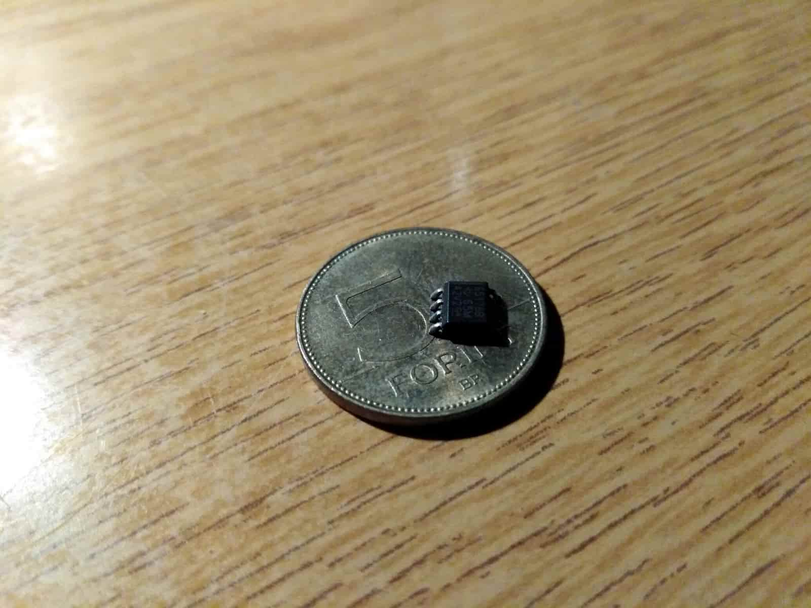

Kisebb nehézséget jelentett az IC bekötése, de csipesszel és rövidre vágott drótdarabokkal egész szépen megoldható. A keresztbekötést tekercselőhuzallal végeztem.

A tekercs `10uH`-s, a két szárnynak kinéző elem pedig két kb. `5nF`-os kondi sorbakötve ami így kb. `2,5nF`. 

Egészen jól néz ki ahhoz képest hogy nem működik:

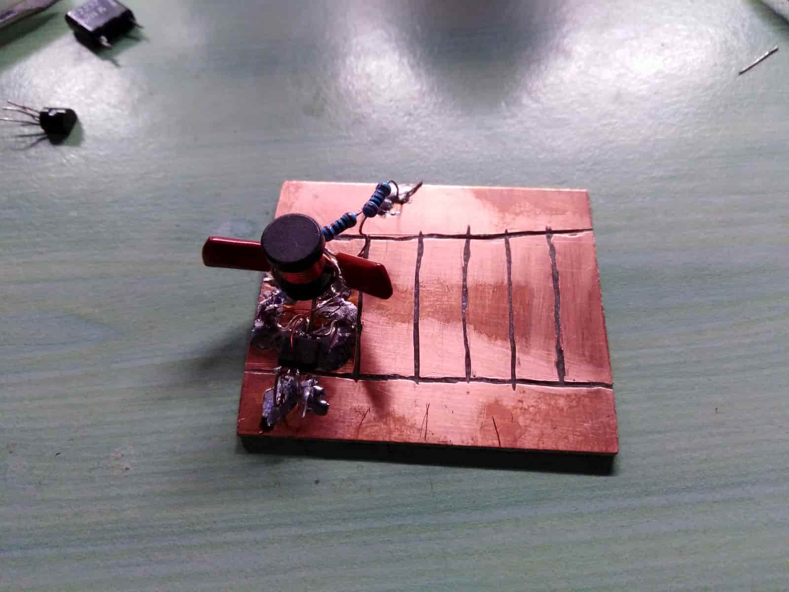
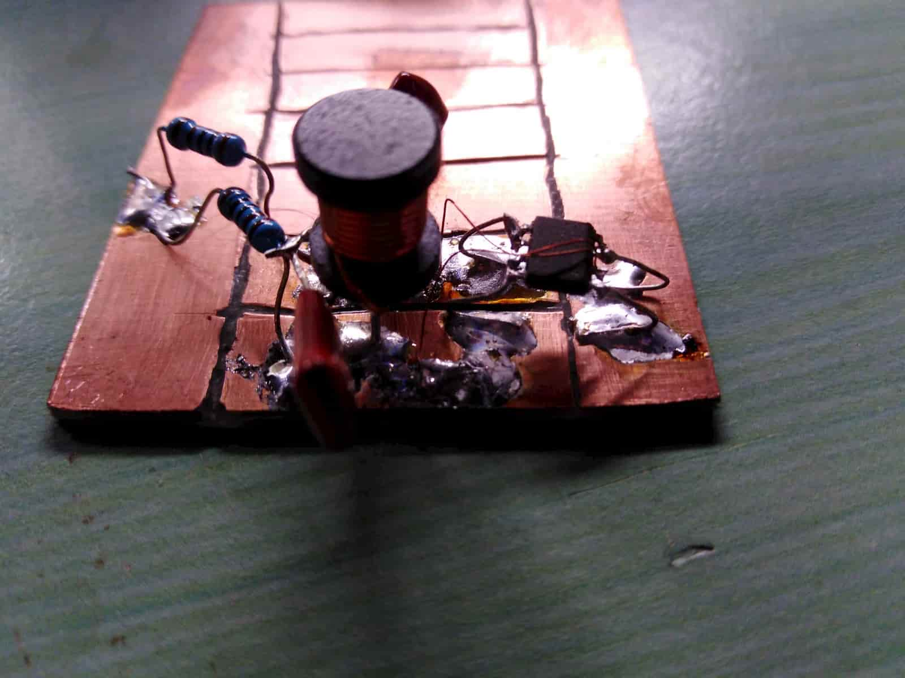

### AM-moduláció - 2020.07.25

Kicsit elegem lett azon modulációs módszerekkel, amelyekről az elmúlt napokban olvastam. Kicsit nagyon, mivel nagy részük az én célomra erősen túlbonyolított, és nehezen használható...

Szóval vissza az első mezőre. Mi lenne ez az AM-moduláció?

#### Moduláció

A rádió folyamatos, periodikus (általában szinuszos) jelre épül: `U(t) = U0 * sin(ωt + φ)`. Ez a folyamatos periodikus jel viszont nem tartalmaz információt, így azt erre a *vivőhullámra* kell ráültetni modulációval.

A fenti egyenletben 3 paraméter van: 
- `U0`, a csúcstól-csúcsig mért feszültség
- `ω`, a körfrekvencia (`2πf`)
- `φ`, a fázis

Ezen három paraméter egyikét az időben vázoltatva különféle modulációs formákat kapunk:
- amplitúdómodulációt (**AM**)
- frekvenciamodulációt (**FM**)
- fázismodulációt 

Mindegyiknek vannak előnyei és hátrányai. Az AM viszonylag egyszerűbb, de jóval érzékenyebb mindenféle zajra és vételi problémára. Régebben igen elterjedt volt, így elég könnyű volt egy rádióvevőt találni hozzá. Az FM manapság felváltotta a jobb hangminőség és kisebb zajérzékenység miatt. Fázismodulációt tudtommal digitális jelek átvitelére használnak.

#### Amplitúdómoduláció

Az AM lényege hogy a jel amplitúdóját szabályozzuk egy másik jellel:

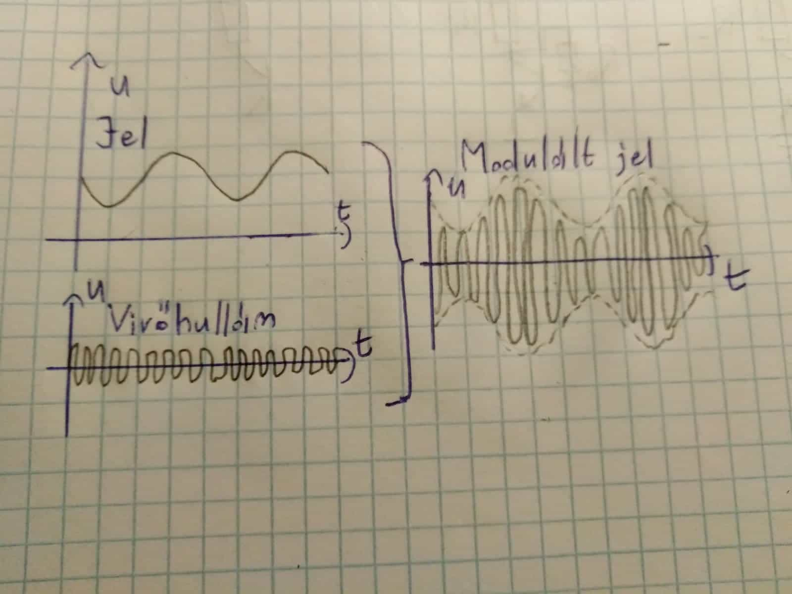

Alaposabban megnézve azt találjuk, hogy gyakorlatilag össze kell szorozni a két függvényt. Érdemes észrevenni hogy AM-ben a moduláló jelnek van egy egyenáramú (konstans) komponense. Ha ez nem lenne, ezt kapnánk:

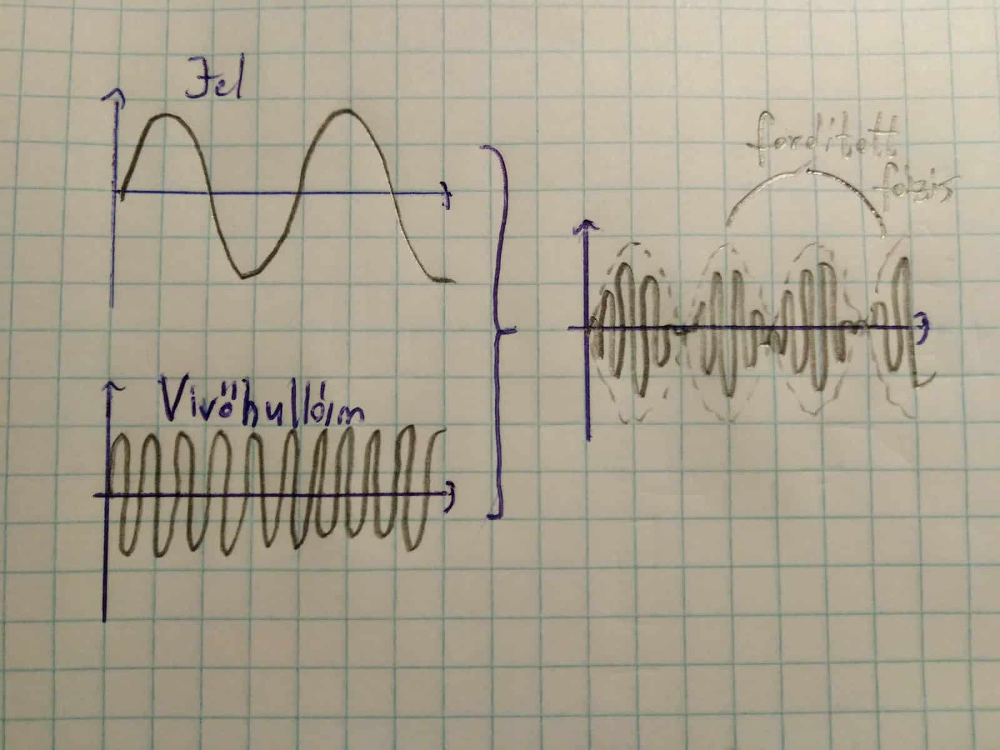

Ez ha minden igaz, az úgynevezett `DSB-SC` (double sideband, suppressed carrier) moduláció.

A moduláló jel váltakozó áramú és egyenáramú komponensének viszonya határozza meg a *modulációs mélységet*

Kis modulációs mélység:
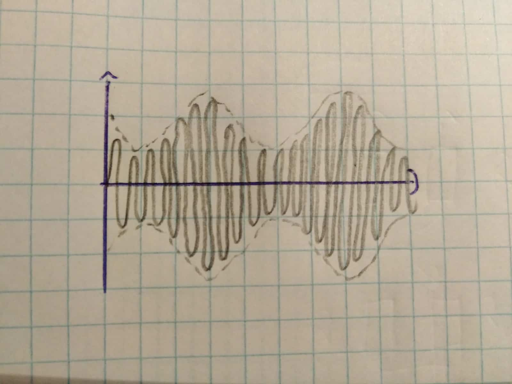

100%-os modulációs mélység
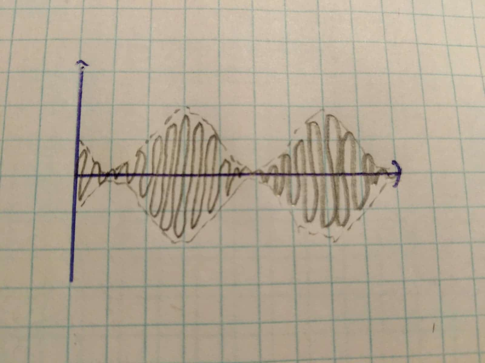

Túl nagy modulációs mélység
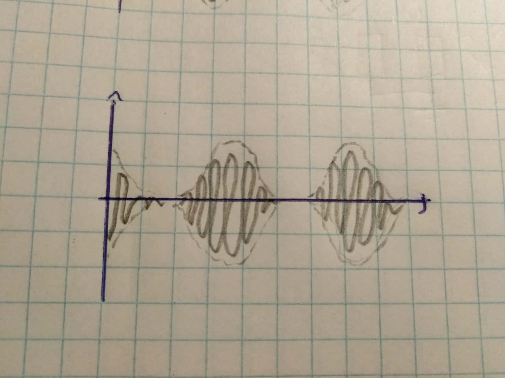

Látható, hogy (a váltakozó komponenshez képest) túl alacsony egyenáramú komponens jelentősen torzítja a jelalakot, így nemkívánatos.
[Béka írt nem is olyan régen erről](http://www.szetszedtem.hu/1174felharmonikusszuro/cbradiohoz.htm)

#### Keverés

A két jel összeszorzása frekvenciaszempontból azt eredményezi, hogy a két frekvencia összege és különbsége fog megjelenni. Ezt rádiótechnikában keverésnek is nevezik. Helyzettől függően a két eredményből néha csak az egyiket akarjuk, így a másikat kiszűrjük, illetve bizonyos keverőtípusok átengedik a bemenő jelek egy részét, ami szintén helyzettől függően lehet jó vagy rossz. A keverő mindenféle másodlagos, harmadlagos, stb. produktumokat is előállíthat a már létrejött jelek további összekeverésével, de ezek majdnem mindig zavaró tényezőként vannak jelen.

A neten elég sok keverőáramkör található. Ezeket lehet lineáris vagy kapcsolóüzemű(switching) keverőkre bontani.

Kapcsolóüzemű keverő pl. a diódagyűrűs keverő, vagy jó pár egytranzisztoros (BJT) keverő.

Lineáris keverő például a Gilbert-cell, vagy az általam használt JFET-es keverő.

A keverők bemenetei lehetnek sima (single-ended) vagy differenciális jelek, akár csak a kimenetek. A Gilbert-cell pl. egy double-balanced mixer, azaz mindkét bemenete (és a kimenete is) differenciális. Ezek ha jól értem nem nagyon engedik át a bemeneteket.

#### JFET-es keverő

A bonyolult soktranzisztoros keverők helyett visszatértem az alapokhoz, és ezzel próbáltam meg egy keverőt tervezni.

A bemeneti vivőhullám amplitúdóját kéne szabályozni a moduláló jel alapján. Ami rögtön az eszembe jutott, az egy ellenállásosztó valamilyen jelfüggő ellenállással. Ide viszont ajánlott lenne egy feszültségfüggő ellenállást használni, nem áramfüggőt. 

Egy másik tranzisztortípust vettem hát elő, a JFET-et. Ezt a típust egészen jól leírja a "feszültségfüggő ellenállás" név, bár ahogy olvasom jobb lenne "feszültségre reagáló ellenállás"-nak hívni, mivel ez is legalább annyi változó paraméterrel van megáldva.

Működését tekintve pont olyan, mint mikor a kerti slagra valaki rálép, és a lépés erejével szabályozza az átfolyó víz mennyiségét. Nem olyan bonyolult talán.

Íme az én modulátorom:

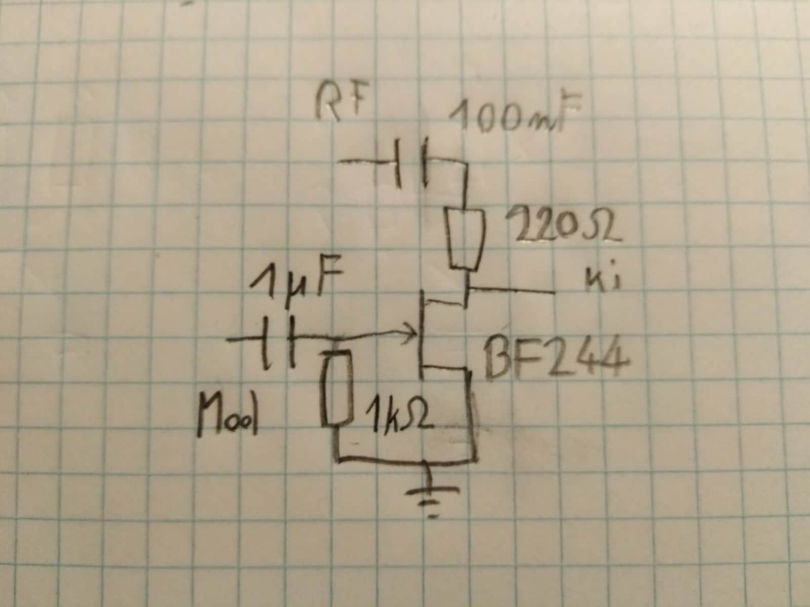

Működése baromi egyszerű: a gate feszültség változása miatt változik a FET ellenállása, és így a kimenő jel amplitúdója. Kicsit eljátszva a szimulátorban az alkatrészekkel találtam egy használható felállást: [áramköri terv](https://www.falstad.com/circuit/circuitjs.html?cct=$+1+3.125e-8+14.235633750745258+50+5+43%0Aj+288+240+352+240+32+-4+0.00125%0Ar+288+240+288+304+0+1000%0Aw+288+304+352+304+0%0Aw+352+304+352+256+0%0Ag+352+304+352+336+0%0Ar+352+224+352+160+0+220%0Ac+352+160+304+160+0+1.0000000000000001e-7+0.028761740778292078%0Ac+288+240+240+240+0+0.000001+-1.240803150385243%0AM+352+224+400+224+0+2.5%0AR+304+160+240+160+0+1+1000000+0.75+0+0+0.5%0AR+240+240+192+240+0+3+10000+2+0+0+0.5%0Ao+8+16+0+4098+1.25+0.1+0+1%0A)

Összeraktam pár alkatrészből, FET-nek a `BF244`-et választva, mivel ebből van egy pár itthon.

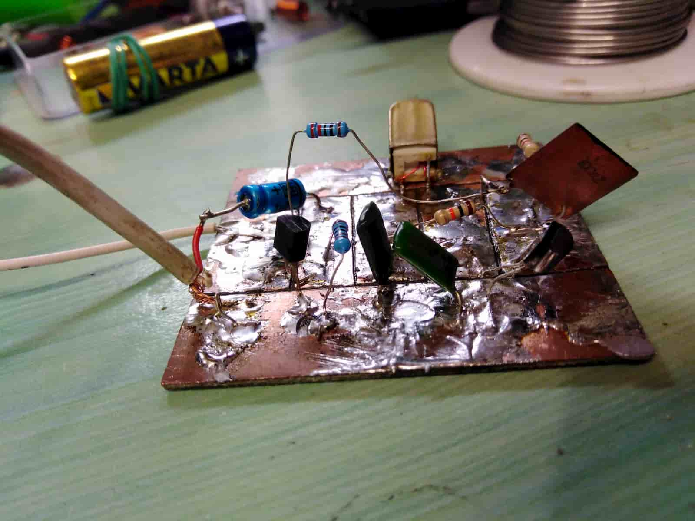

Eredmény: fényes siker! Működik a moduláció

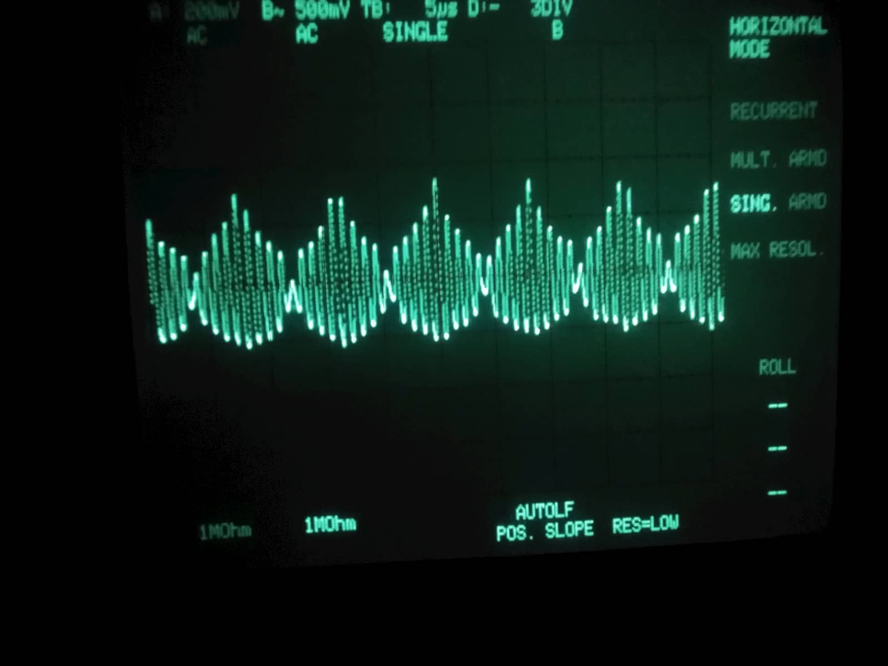

Először [a függvénygenerátoromat kötöttem rá](https://youtu.be/-Vt--0ubYpI), azután később [kipróbáltam zenével is](https://youtu.be/w8PXaoqKUH4).

#### Konklúzió

További teendők:
- RF teljesítményerősítő építése
- LPF (low-pass filter, aluláteresztő szűrő) építése
- oszcillátorfokozat átgondolása?

### RF erősítő + projekt lezárás?

(kicsit jóval később írom ezt, úgyhogy inkább rövidre fogom hogy kevesebbet tévedjek - no meg egy fél képet sem találtam meg abból amit csináltam)

Terveztem egy egytranzisztoros erősítőt, ami a modulátor kimeneti jelét (kb. `800mV` csúcstól csúcsig) kicsit felerősítené. Mivel az oszcillátor nem működik 9V alatt, így ezt a tápfeszültséget használva elég nagy a mozgásterem. Még nem voltam benne biztos (és ma sem vagyok igazán) hogy a nagyobb távolsághoz nem hangolt antenna esetén nagyobb feszültség vagy nagyobb áram kell, így első körben egy emitterkapcsolású áramkört terveztem, amely főként a feszültséget erősíti - ehhez könnyen kapcsolható lesz egy kollektorkapcsolás, amely pedig az áramot erősítené jelentősen.

A emitterkapcsolás feszültségerősítése a kollektor és emitter ellenállások arányától függ. Az alkatrészes dobozban keresgélve a `6.8k` és `1k`-s értékeket választottam, ami kb. `5.44V`-os kimeneti feszültséget jelentene - kicsit talán kicsi a `9V`-os táphoz képest, de első körben megteszi, és a nagyobb mozgástér akár segíthet is. A munkapontot A osztálynak megfelelően állítottam be (egy poti segít ebben, hogy minél pontosabban beállítható legyen).

Az erősítő erősítése frekvenciafüggő, minél nagyobb frekvencián használjuk, annál kisebb. Mivel a tranzisztor amit használtam (`BC238`) valamivel több mint `100MHz`-s határfrekvenciával rendelkezik, nem kéne jelentősen csökkennie az erősítésnek.

Az áramkör egészen jól működött, de elég sokáig tartott erre rájönnöm...

Megmérve a kimenő jelet szkóppal, a bemeneti paramétereket frekvenciagenerátorral utánozva jelentősen kisebb jelet mértem mint kellett volna - olyan `7-800mV`-ot - azaz erősítés helyett maximum tartotta a feszültséget. Leginkább az imént említett nagyfrekenciás hatásra gyanakodtam.

Ezen hatás egyik kompenzálási módja egy kondenzátor párhuzamosan kötése az emitterellenállással. Gondoltam kipróbálom - sajnps már nem találom a szép fotókat a jelalakról, úgyhogy csak körülírni tudom hogy mennyire háromszögletű volt... Konkrétan maximum 10dB-veel elnyomott második felharmonikusakat tartalmazott, és 100kHz-ről hajtva a 10. felharmonikus még mindig zavarta az AM vételt az erősítő közelében... Az áramkört mindenesetre megjegyeztem, mert igen kiváló frekvenciatöbbszöröző lehetne belőle kis szűréssel és további A osztályú erősítéssel...

Keresvén a gyenge jelek okát, [írtam egy kérdést az electronics stack exchange-re](https://electronics.stackexchange.com/questions/514379/common-emitter-bandwidth-and-probing/), ami alapján még hülyébbnek tűnök mint szoktam.

Long story short: a mérést basztam el. Baromi kezdő hiba. A 100mHz-s kiciócó kínai mérővezeték (ami egyébként egy jó vétel volt, amúgy egy igazi max quality cuccal is simán el lehet követni ezt a hibát) akkor 100MHz-s, ha x10-es módba kapcsolom - amúgy egyrészt csak kb. 1MHz-s, másrészt elég nagy kapacitással rendelkezik hogy jelentősen terhelje az áramkör kimenetét és ennek örömére (a bazi nagy kimeneti impedancia miatt) a feszültség szépen lecsökkenik. Állítólag baromi gyakori kezdő hiba, de három napom ráment mire megtaláltam. Az erősítés valamivel kisebb mint 6.8, de simán belefér - egy 10k-s kollektorellenálllás valószínűleg egészen jó választás lenne ide, feltéve hogy nem gondolom meg magam a szokatlanul alacsony kollektorárrammal.

Amúgy az adó hatótávja nem lett sokkal nagyobb, de azért érezhetően használt neki az erősítő.

#### És egy lezárás, sort of

Ez egy baromi fun projekt, és inkább csak felfüggesztem mint lezárom most. A helyzet az, hogy lassan vége a nyárnak, és kezdődik a kollégiumi beköltözés, de méginkább az egyetem. Mivel nem óhajtok az első félév után kibukni, nem ártana valószínűleg elég sokat tanulni, amelynek egyenes következménye hogy nem éppen lesz sok időm ilyen projektekre. Egy másik tényező pedig az, hogy (ha nem is feltétlen az első félévben) de fogunk mi annyi munkapontbeeállítást, váltakozóáramú áramköröket és analóg kapcsolást tanulni, hogy majd én is csodálkozva olvasom vissza ezt a naplót hogy mégis hogy unatkozhattam én annyira hogy önként ezeket akartam a szabadidőmben tanulni...