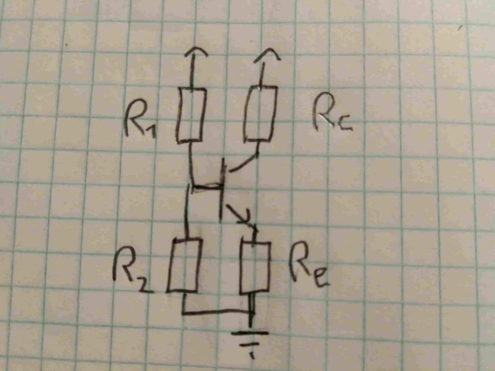

# Tervezzünk rádióadót

Avagy hogy a jófenébe működik az a tranzisztor vagy micsoda?



[Vissza](../elektro.md)

Figyelem! Ez a projekt annyira folyamatban van hogy csak na! Próbálom megérteni az elméletét baromi sok dolognak, és ennek megfelelően itt leginkább bénázás várható!

## Motiváció

Amióta tudom hogy van olyan hogy tranzisztor (ovis korom?), érdekel hogy hogyan működik. Ennek egy részét végre értem (bár várni kellett rá pár évet), most már "csak" az érdekel hogy hogyan tudok saját áramkört építeni vele, hiszen mások által tervezett áramkört összeszerelni **unalmas**.

Mindig is vonzottak a rádiók is. A legelső vevőmet kb. ovis koromban építettem, ami nehezen volt rádiónak nevezhető (félig szétszedett erősítő), de a helyi nemzetiségi adás bejött rajta szépen, tehát rádió volt...

(azt az apróságot azért ne felejtsük el hogy az a helyi adó gyakran olyanon is bejön amin nem kéne...)

Adót viszont még egyet sem építettem, szóval miért ne kombináljunk két dolgot amihez külön-külön sem értek, hátha a kettő együtt jobban megy? Ha másért nem, legalább látványosabb lesz a pofára esés (talán még nagyfeszültség kéne bele, hogy fájjon is)...

### Célok

- AM adás sugárzása a lakáson belül (lehetőleg a környéket nem zavarva)
- saját tervezésű áramkör, kész elemeket NEM átvéve másoktól
- lehetőleg jó hangminőség
- diszkrét tranzisztoros adó, semmi csalás mindenféle IC-kel és egyebekkel

## Progress

(Ez a rész majd frissül ahogy több minden nem működik)

### Előtanulmányok

Elég sokat olvasgattam már tranzisztorokról, munkapont-beállításról, előfeszítő áramkörökről és azok béta-függetlenségéről, illetve harmonikus oszcillátorokról. Elvben ismerem az AM-moduláció működését is, na meg jól megy az alapvető elektronika, úgy mint Ohm törvénye, Kirchhoff törvényei, illetve a középiskolai matek-fizika.

Hogy segítsem magam a hibakeresésben (és *egyáltalán* nem azért hogy dicsekedjek a tudásommal, mert az jelen pillanatban bőven kevés még ehhez az egyszerű projekthez is), igyekszem majd mindenféle magyarázó szövegeket és/vagy ha időm (és kedvem) van rá, ábrákat beszúrni ide.

### Első nap - 2020.07.16.

A mai napon kezdtem el ténylegesen foglalkozni a projekttel.

Először is, megnéztem egy AM rádiót, hogy mekkora frekvenciára kell áramkört tervezzek.
A legtöbb itthon talált vevő AM sávban kb. a 600-1200 kHz-t fedi le. Középértéknek 1MHz-t választottam. 

Az első feladat egy működő 1 MHz-s oszcillátor felépítése. Biztosan egyszerű, ha ért hozzá az ember...

#### oszcillátor

Az oszcillátoroknak utánaolvasva a működésük elég intuitív. Nem kell más, mint egy erősítő, aminek a kimenete vissza van kötve a bemenetére - egy megfelelő szűrőáramkörön keresztül. Az erősítő begerjed, és a szűrőűramkör biztosítja hogy ezt a megfelelő frekvencián tegye.

A szűrőáramköröket általában L és C elemekből (azaz tekercsekből és kondenzátorokból) építik fel. A két leggyakoribb típus a Hartley-féle és a Colpitts-féle.

Colpitts:

Hartley:

Az oszcillációnak itt két feltétele van, amelyek szintén intuitívak (Barkhausen stabilitási kritériumok vagy mik ezek):

- Az egész rendszerben az erősítés a célfrekvencián minimum egységnyi 
Azaz az erősítő ellensúlyozza a szűrőn és egyebeken létrejövő veszteségeket, így az oszcilláció stabil - illetve bekapcsolás után a cél amplitúdó fokozatos eléréséig nagyobb erősítés kell, nem csak a veszteségek pótlása.
- A teljes hurokban a célfrekvencián a fáziseltolódás erősítő interferenciát hoz létre.
Azaz az erősített jel a már jelenlévő gyengébb jelhez hozzáadódva azt erősíti, nem gyengíti.

Ezek ha minden igaz, teljesülnek a Colpitts és Hartley-oszcillátoroknál - majd csinálok egy pontos levezetést.

> (pontos levezetés lesz ide beillesztve ha csinálok egyet)

(fontos megjegyezni, hogy mind a két típus olyan erősítőt használ, ami eleve csinál egy 180°-os fázisfordítást, így a szűrőáramkör is 180°-ra van tervezve!)

Szóval kell akkor két dolog:
- erősítő
- visszacsatoló (szűrő) áramkör

#### szűrő

Az egyszerűbb talán a szűrő. Választhatunk a Colpitts és Hartley között. Mivel biztosak lehetünk benne hogy fix értékű alkatrészekből nem lesz pontos a frekvencia, így mindkettőbe kell valamilyen hangolható elem. Hartley-ba állítható tekercs, Colpitts-ba állítható kondenzátor illik. Előbbit nehéz készíteni (bár mintha lenne itthon pár darabom), így inkább a Colpitts mellett döntöttem - legalábbis egyenlőre.

A pontos értékek meghatározásához nem kell más mint a Thompson-képlet: `f=(2*pi*sqrt(LC))^-1` (kéne Latex support a blogba!). ITt két független változónk van: `L` és `C`. Én utóbbit vettem fixnek - két `100nF`-os kondit "sorbakötve" `C=50nF` lett. Innen megoldható az egyenlet, kiszámolható hogy `L=500nH` (körül-belül), és egy online számológép segítségéve már meg is tervezhető a tekercs - nem lesz túl nagy darab...

Kis kitérő: első körben két `500nF`-os kondiból csináltam `250nF`-ost, így `L=100nH`-t kaptam, így egy jóval kisebb tekercset készítettem. Nem működött (ez sem), így elsődlegesen a két kondit okoltam, mivel elektrolitok voltak, amik híresek arról hogy nagyobb frekvenciákon nem működnek jól.

#### erősítő

Akkor már csak az erősítőt kéne megtervezni. A legegyszerűbb talán egy egytranzisztoros erősítő lenne. Ezeknek 3 fő fajtája van:
- báziskapcsolású - nincs áramerősítés, de viszonylag nagy a feszültségerősítés
- kollektorkapcsolású (alias emitterkövető) - nincs feszültségerősítés (sőt, ~0.6V-ot le is vesz), de elég nagy az áramerősítés
- emitterkapcsolású - mind áram, mind feszültségerősítés van

Na de hogyan is működnek ezek?

##### tranzisztor

(figyelem! amit most írok, az mind az NPN típusú BJT tranzisztorokra vonatkozik, a többi típus létezését most figyelmen kívül hagyom!)

"A tranzisztor egy háromlábú állat" - azaz 3 kivezetése van neki. Ezek (nem feltétlen sorban) az `emitter`, a `bázis` és a `kollektor`.
Áram folyhat (általában) a bázis-emitter és a kollektor-emitter irányban.
Ha jól értem, két dolgot fontos tudni róla:
- a bázis-emitter egy dióda, az ahhoz tartozó szabályokkal együtt. Kb. 0.6-0.7 V feszültség esik rajta, típustól, terheléstől (és holdfázistól) függően.
- a kollektor-emitter-en a bázis-emitter áram egy bizonyos (nem feltétlen egész) számú (béta) többszöröse folyik. 

Tehát a tranzisztor gyakorlatilag egy áramvezérelt ellenállás.

A béta-érték függ a tranzisztor típusától, a konkrét példánytól, a hőmérséklettől, az átfolyó áramtól, és a Merkúrnak a Jupiter holdjaival bezárt szögétől. Általában lehet `B=200`-al közelíteni, de ez elég durva közelítés...

##### erősítők osztályozása

Az erősítők 4 fő *működési osztályba* sorolhatók:
- A osztályú - a (periodikus) jel periódusának egész ideje alatt "nyitva van" a tranzisztor, azaz minimális torzítással átmegy az egész jel
- AB osztályú - A és B típus között van
- B osztályú - a jel periódusának pontosan felében van nyitva a tranzisztor, azaz a jelnek csak fele megy át, ami torzítást jelent 
- C osztályú - a jel periódusának kevesebb mint felében van nyitva a tranzisztor

Hasraütésszerűen kiválasztottam az A osztályt, remélem be fog válni...

Az erősítő osztályát az egyenáramú beállítás határozza meg - azaz hogy az erősítő be és kimenete jel nélkül milyen egyenáramú szinten van - persze a jelhez és a tápfeszültséghez képest.

##### Erősítő kritériumok

A [Wikipédia szerint](https://en.wikipedia.org/wiki/Common_emitter) az emitterkapcsolású erősítő erősítése az `Rc/Re` aránytól függ. Ezt én első körben 10-re választottam, ahol `Rc=1k` és `Re=100 ohm` - ezek hasraütésszerű értékek kombinálva a rendelkezésre álló alkatrészekkel. Az erősítőt A osztályban szeretném üzemeltetni, a lehető legnagyobb kimenő feszültséggel - azaz a jel nélkül a kimeneten a tápfeszültség fele legyen. Tápfeszültségként 9V-os elemet használva `8-9V`-al számolhatok

##### Előfeszítés (biasing) - egyenáramú beállítás

A tranzisztor **munkapontját** kell tehát meghatározni - azaz a kimeneten alapból jelen levő egyenfeszültséget. Ez ugye az előbbiekben leírtak szerint `4-4.5 V` kell hogy legyen.

A legegyszerűbb kiindulni `Rc`-ből. Tudjuk az értékét (`1k`), és a rá eső feszültséget(`4V`), így ki tudjuk számolni `Ic`-t - `4mA`.

Mivel `Ie=Ic+Ib` és `Ic>>Ib` így jó közelítéssel `Ic=Ie`. Mivel ez pontosan az az áram, ami átfolyik `Re`-n, így szintén ismerjük az erre eső feszültséget. Ez hamarosan igen hasznos lesz...

Ha ismerjük a tranzisztor bétáját, akkor elég könnyedén meghatározhatunk egy `Rb=(Utáp-Re*Ie-0.6)/Ib`, ami beállítja a nyugalmi áramot:

Az egyetlen szépséghibája ennek az, hogy a tranzisztor bétája mindentől IS függ, beleértve a mexikói peso forintárfolyamát és a mérnök aktuális véralkoholszintjét, így eléggé nem stabil ez a beállítás - arról nem is beszélve hogy baromi nehéz két egyformát találni, tehát sorozatgyártásra sem éppen alkalmas ez az áramkör...

Egy jobb módszer `Rb`-t `Re`-vel sorbakötni, így valamelyest stabilizálja a rendszert:

De a legjobb módszer talán egy feszültségosztót használni:

Itt az `R1`-re eső feszültség ugyan akkora mint az `Re`-re eső plusz az `Ube` 0.6-0.7V-ja. Ha tudjuk a tervezett `Ic` alapján az `Re`-re eső feszültséget, akkor ahhoz a 0.6V-ot hozzáadva megkapjuk a feszültségosztó értékét. Ezt persze kerekíteni kell a ténylegesen rendelkezésre álló alkatrészek alapján, de mivel csak az `Ube` változik igazándiból, így ez egy elég stabil és béta-független beállítás. Hozzá kell még tenni hogy a feszültségosztót úgy kell megtervezni hogy a rajta folyó áramhoz képest `Ib` elég kicsi legyen, és ne befolyásolja így a beállított feszültséget.

Az első próbálkozásként én ezt az áramkört választottam, az osztót egy `10k`-s és egy `1k`-s ellenállásból felépítve. Ezek az értékek nem éppen ideálisak, mivel bőven nem a tervezett szintre állítják be az áramkört...

#### Összeszerelés

A teljes oszcillátor rajza így:

Első verzió:

A második verzió ugyan ez volt, csak 2x`100nF`-al és egy `500nH`-s induktivitással

És a megépített áramkör "próbanyákra":

> (sajnos hamarabb szétszedtem mint lefotóztam volna)

#### Eredmény

Működni nem igazán működi, nem látok oszcillációt sehol az áramkörben.

További teendők - első kör:
- képeket beszúrni ide
- áttervezni az erősítőt kisebb erősítésre?
- képeket beszúrni ide
- áttervezni a munkapont-beállítást megfelelőre
- képeket beszúrni ide
- nagyjából ellenőrizni a tekercs induktivitását?
- új NYÁK tervezése, jobb elrendezéssel, amely minimalizálja a rövidzárak lehetőségét

Papíron már terveztem egy újabb erősítőt, 4.5V-ra: itt az osztó `2:5` arányú, `Rc=2k`, `Re=1k`, `Au=2`. Majd kipróbálom hogy működik-e...

Második kör - ha végre oszcillál:
- hangolhatóvá tenni - változtatható kondenzátor vagy tekercs beépítése (váltás Hartley-ra?)
- puffererősítőt tervezni (mondjuk emitterkövetőt), amely majd az antennát hajtja
- AM-modulátor áramkört tervezni

### Második nap - 2020.07.17.

Elkezdtem hibát keresni az előző napi áramkörben. Rákötöttem egy függvénygenerátort a tranzisztor bázisára, és mértem a kimenetet - a tranzisztor NEM erősítette megfelelően az 1MHz-s jelet. Leginkább a visszacsatoló áramkörre gyanakszom, amely a csatolókondenzátor miatt szűrőként viselkedhet... De nem igazán tudom viszont találtam egy módszert a kikerülésére.

#### Szűrőkör

Átmértem egy tucat állítható tekercset, amelyeket egy barátomtól kaptam, aki minden valószínűség szerinte egy TV-ből bonthatta őket. A legkisebb érték amit találtam kb. `1 uH`-s volt. Ezekhez kb. `5nF`-os kondenzátorok illettek. Ezek a tekercsek minden valószínűség szerint jobb minőségűek és könnyebben hangolhatók mint amit én készítettem, így érdemesebb ezeket használni.

A módosított áramkör sajnos még mindig nem volt hajlandó oszcillálni, és a jel még mindig erősen tompítva jelent meg a kollektoron.

#### Erősítő munkapontja

Egy kis utánanézés után találtam pár tucat Colpitts-áramkört. Elég sokféle módon állították be a tranzisztor munkapontját, és ennek megfelelően elég sok különböző módon illesztették a visszacsatoló kört.

Az egyik egyszerűbb áramkör a következőképpen nézett ki:

Ez egy egyszerűbb munkapontbeállító áramkört használ, és a visszacsatolás is kicsit egyszerűbben van illesztve. A korább illesztésnél a kondenzátor azért kellett, mert a kollektor és a bázis nem azonos egyenáramú szinten kell hogy legyenek, így ennek a szintnek az illesztését végzi. Ebben az egyszerűbb verzióban viszont az `1k`-s ellenállás pontosan elvégzi ezt a feladatot. 

#### Összeszerelés

Próbaképpen átépítettem a panelt erre az áramkörre, de ezzel sem volt még sok sikerem. Oszcilloszkópos mérésekkel megállapítottam hogy létrejön oszcilláció, de valamiért nem stabil, elég gyorsan elhal. A tápfeszültség fokozatos növelésével viszont sikerült stabilizálni - `9V`-on megbízhatóan működik.

Az egyik szépséghibája ennek az volt, hogy a `100OHm`-os ellenálláson ekkor elég nagy áram folyt, és rendesen túlmelegedett...

##### Csúnya jelalak

A másik hiba a jelalak volt:

Frekvenciaspektrum:

Jól látható hogy az alapvető frekvencia jó helyen van, viszont az első két felharmonikus (3x-os és 5x-ös frekvencia) igen erős - `10dB`-vel (1/10) és `20dB`-vel (1/00) gyengébbek csak.

Ez az áramkör a közelébe rakott AM rádiót már képes megszólaltatni, de gyakorlatilag az AM sáv egészében, a többi adást zavarva. Kezdetnek nem rossz, erős szűréssel talán javítható, de nem az igazi.

A jelalak alapján erősen torzít az erősítő. Az alapján amit tudok, ennek két oka lehet:
- B vagy C működési osztály
- telített tranzisztor

Mivel a működési osztály a munkaponttól ÉS a jeltől függ, és a jel amplitúdója magától áll be, ha jól értem ezt az áramkört, mindig akkora lesz hogy A osztályban működön.
(a nagyobb amplitúdó miatt a jel egy része le lenne vágva, ami felharmonikusakat hozna be, amit kiszűr a szűrő, és nem kerülnének újra a bemenetre - vagy valami ilyesmi, lehet hogy egyáltalán nem így van - az első verzió mintha nem így működne).

##### Megoldás

A `100Ohm`-os ellenállás melegedését a legegyszerűbben oldottam meg - a bázis (és egyben a kollektoráram) csökkentésével. A `100Ohm`-os ellenállást `1k`-ra cseréltem, míg az `1k`-sat `10k`-ra. A hatás: a melegedési probléma megoldva, és bónuszként a jel is szebb lett (bár ennek okában nem vagyok biztos):

Na és a spektruma:

Ez máris sokkal kevésbé zavarja az AM adókat, csakis a saját frekvenciája környékén teszi, míg az előző gyak. mindent zavart.

A második napot itt fejeztem be, mivel már van egy működő oszcillátorom. A kimenete elég gyenge, jöhet majd még rá egy emitterkövető. A spektruma első ránézésre jó, de még lehet hogy egy sávszűrő nem ártana rá...

#### Eredmény

CW adónak már akár alkalmas.

A további teendők:
- képeket beszúrni ide
- hangolhatóságot tesztelni
- AM moduláció (lehet hogy SSB-t egyszerűbb lenne?)
- puffererősítő
- új nyák / elrendezés