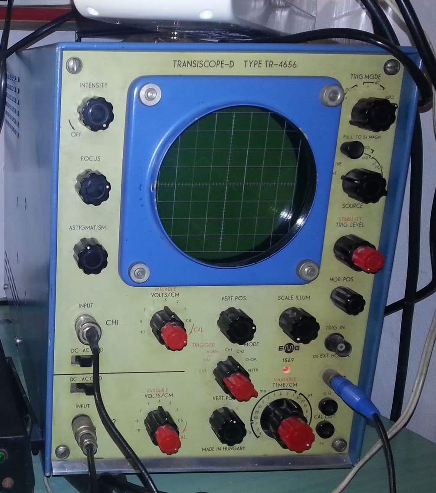
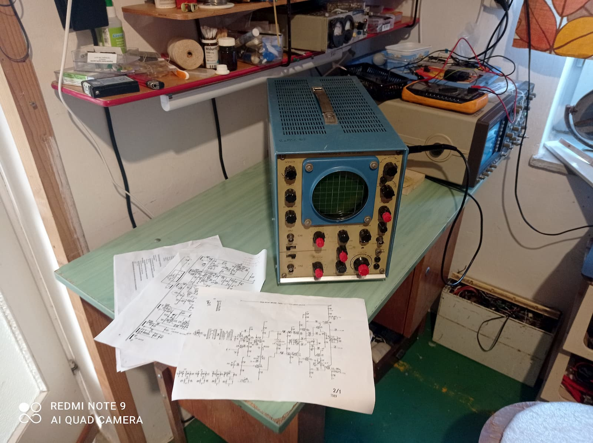
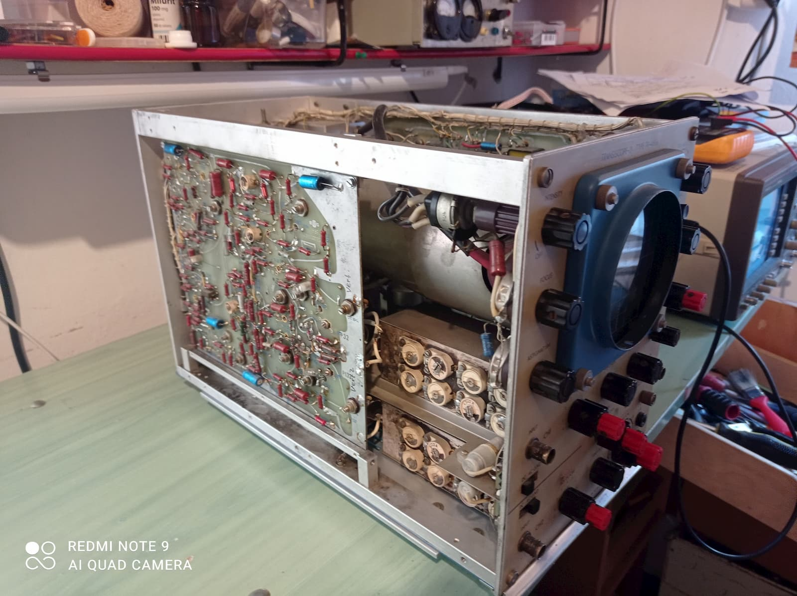
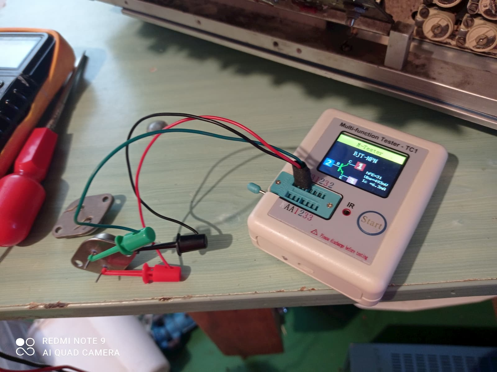
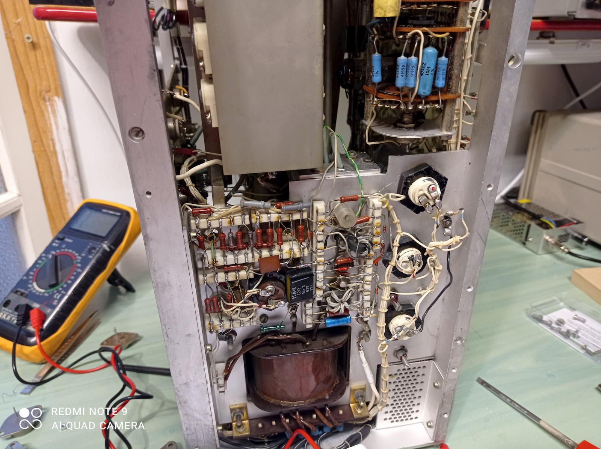
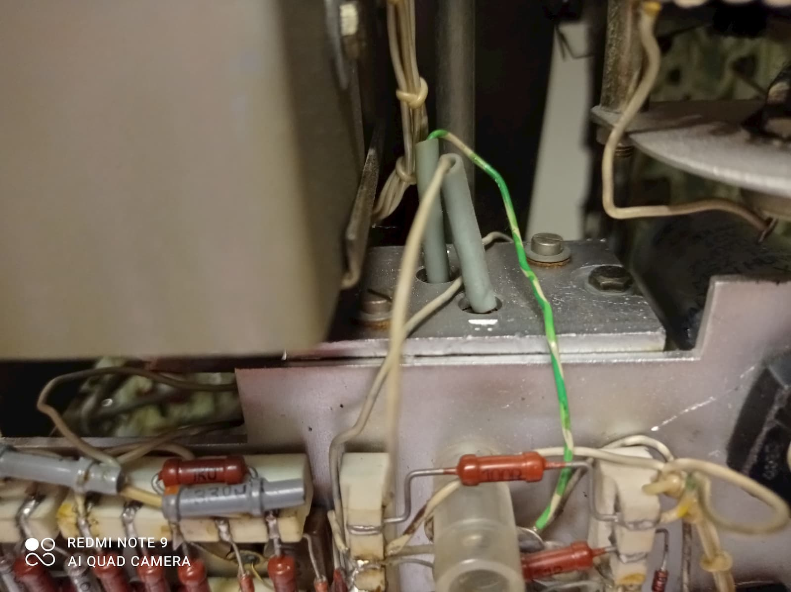

# EMG szkópom javítása
Egy igen régi és igen szép mérőeszközt próbálok megjavítani

[Vissza](../elektro.md)

## A készülékről

A szkópot egy ismerősömtől kaptam igencsak használtan, ő pedig azt sem tudta hogyan működik. Ez volt az első igazi oszcilloszkópom, és segített is jó pár projektnél.

Egy pár hónap használat után elkezdett sajnos érdekesen viselkedni - földelt bemenettel is jeleket rajzolt, és a trigger működése is megbolondult. A hibát valószínűleg a tápfeszültség(ek egyikének) zaja (brumm) okozta - a HE fórumon azt javasolták, a szűrőkondenzátorok (elkók) rögzítését húzzam meg, mert megoldhatja a problémát - és meg is oldotta.

Volt még pár apró probléma, de azokat mindet hibás érintkezés vagy kábelszakadás okozta, és könnyen megoldhatóak voltak.

## Az első kör
(Ctrl-X, Ctrl-V a "folyamatban lévő" oldalról)

Az EMG-4656-os szkópom elromlott, brummos volt.

A HE fóromon azt javasolták cseréljem ki az elkókat, majd amikor írtam hogy sikerült őket kiműteni, alaposan lecsesztek hogy miből gondolom hogy azokkal van a baj... A régi elkók jónak tűnnek, és sikerült valahogy visszaszerelni őket, és újra volt (brummos) kép.

Úgy gondoltam hogy a szkóp újrakalibrálása segíthet, ha más nem akkor megtalálhatnám a hiba forrását. A gépkönyv kalibrációs leírása viszont igencsak érdekes:
- az ábrák hivatkozásai teljesen hibásak, ha azt mondják hogy valamit az 5-ös ábrán keress akkor csak az biztos hogy nem az 5-ös ábrán lesz
- semmilyen leírás nincs az egyes alkatrészek / beállítószervek helyéről, csak a hibás ábrahivatkozások
- a leírás pár helyen hibás, nem létező alkatrészeket említ illetve rossz beállítószervekre hivatkozik.

[Az ilyen hibák javítására átírtam a leírást egy új dokumentumba.](https://docs.google.com/document/d/1qmQ0HcECZFvDG5XUfFSKzFTRhJNQkfdh3wTJpYy6CwA/edit?usp=sharing) Leírtam minden alkatrésztől ami előfordul hogy hol kell keresni, illetve a hibás részeket is javítottam. Elég sok időm ráment mire mindent megtaláltam ami kellett...

Amikor bekapcsoltam hogy elkezdjem a kalibrálást, nem jelent meg a fénycsík, és a nagyfeszültség dobozában valami világított. Mivel nincs merítőellenállás a kondikon, így félreraktam egy darabig hogy biztonságos legyen belenézni (na meg akkoriban érettségiztem). Lehet hogy a nagyfeszültségű dobozban valamit egy picit elgörbítettem amikor próbáltam kideríteni hogy melyik poti melyik?

Amikor újra elővettem, a nagyfesz doboz csendben maradt, nem volt csőfűtés sem. Elkezdtem mérni a tápfeszültségeket - a -45V-on -60V-ot mértem! Véletlenül rövidre zártam ezt a tápfeszt a kondinál (a kondi fémburkolata és kivezetése között a mérőzsinórral). Ekkor megjelent a csőfűtés, és a tápfesz is megmaradt. Valamivel később mindkettő eltűnt, és azóta sem jutottam vele többre...

Ha legközelebb előveszem akkor megkeresem a tápfesz útját a trafótól, és megpróbálom kideríteni hogy miért nem jók a tápfeszültségek. Remélhetőleg velük együtt a nagyfeszültség, és azzal a kép is visszajön.

(javítás: azt hiszem előbb zártam rövidre minthogy -60V-ot mértem volna)

## Egy újabb próba - 2020.08.26

Előszedtem újból a kapcsolási rajzot, és nekiálltam kielemezni hogy mi romolhatott el. 

A -45V-os tápfeszültség hiányát okozhatja az áteresztőtranzisztor meghibásodása. Egy `2N3055`-ös teljesítménytranyóról van szó, amely a hűtés miatt nem a panelen helyezkedik el, hanem valahol a fémvázra rögzítve.

A panelrajz alapján megtaláltam hogy hol csatlakozik két vezeték (a tranzisztor bázisa és kollektora) a bal oldali panelhez, gondoltam ez alapján könnyebb lesz ellenőrizni.

Első lépésként lepakoltam az asztalról

Ez a látvány elég ritka, hiszen ha egy asztalon dolgoznak akkor az nem így néz ki. Szerencsére már egy ideje igyekszem rendet tartani, így elég gyorsan el tudtam pakolni azt a pár dolgot ami összegyűlt. 

Na ezután jöhet a főétel:

El is felejtettem hogy mennyire nehéz cucc ez, ezt csak a `PM3323` múlta felül (és ezt szerencsére nem kellett BKV-vel szállítanom). A kinyomtatott oldalak a kapcsolási rajzból mellette voltak elrakva.

A belseje első ránézésre nem vészes:

Két oldalt panel, középen képcső, és a bal oldali panel kihajtható.

Na de ha jobban megnézzül

Ez a kábelezés valami borzalmas, egy kontakthibagyűjtemény az egész, ráadásul a színkódolás csak részleges, sokszor csak tippelni lehet hogy mi hova csatlakozik - nem árt jól körbefotózni szétszedés előtt, mert nagyon megkönnyíti a későbbi összerakást.

Kiforrasztottam a két kivezetést (harmadik test/föld), és rámértem a mindentmérő kínai kütyümmel:

Hát ez nem éppen néz ki jól. Őszerinte ez két ellenállás, egy 100 Ohmos és egy 0.46-os. Hát ez nem néz ki jól.

A biztonság kedvéért gondoltam megnézek pár másik `2N3055`-öt is, hátha csak a mérőnek van baja ezzel a típussal.

Amikor szétválogattam a félvezetős fiókot akkor még én is úgy éreztem hogy hiábavaló időtöltés, de most jól jött:

Ezeket még apám szerezte fiatalabb korában, mivel kb. akkoriban volt hobbielektrós amikor ez a szkóp is készült.

Sajnos egy másik példány mérése teljesen más eredményt hozott, úgy tűnik tényleg ez halt meg.

Első lendületből 3 teljesítménytranzisztort is találtam a doboz hátuljára szerelve, ebből az egyiken elég nagy hűtőborda volt, így gondoltam érdemes megnézni:

(később jöttem rá hogy elfelejtettem hogy melyik kábelt húztam le honnan, de szerencsére az egyik távolabbi képen tisztán kivehető)

A mérőm nem mért rajta semmit, így leszereltem - gyanús volt hogy hátha ez az, és akkor gyorsan megúsztam.

Na nem nyert, ez egy `ASZ1018`-as példány, a kábelek visszakövetése alapján a +15V-os tápé. Emellett arra is rájöttem hogy germániumtranzisztor, és mint olyan, kisebb a nyitófeszültsége mint a ma elterjedt szilíciumtranzisztoroknak - és ez meg is magyarázza hogy miért nem ismerte fel a mindentmérő.

Visszaszerelni kicsit trükkös volt (és nem is vagyok biztos benne, majd újra ránézek) - viszont ez azt is jelenti hogy még keresnem kell a hibás példányt.

Gyorsan megnéztem a másik kettő tranzisztort is a hátulján - mindkettő germánium és mindkettő jó. Gondoltam belenézek a gépkönyvbe, hátha benne van valahol hogy hol van az a tranyó...

Gépkönyv szerint "a +15, -15 és +85 V tranzisztorai a készülék hátulján vannak elhelyezve". Tök jó, kár hogy erre pont ezelőtt jöttem rá. De akkor hol a jófenében lehet az a `2N3055`?

Követtem a kábeleket, és egy részük a készülék alja felé vezetett...

Né! Ott az az ellenállás 100 ohmos - és pont egy ekkora kéne hogy legyen a tranyó bázisán. Feltűnt hogy a másik panelen kimaradt (és ez belejátszhatott volna abba hogy a mérés nem ismerte fel, de mivel egy sima multiméterrel is mindkét irányban átvezetést mértem, elég gyanús hogy tényleg KO).

Onnan pedig megy egy drót, és már meg is találtam a keresett tranzisztort!

Komolyan ezt aztán igen kiválóan elhelyezték, halványlila gőzöm sincs hogy ezt én hogyan fogom onnan kiszerelni ha tényleg ő a hunyó.

Konkrétan úgy né ki hogy rá van szerelve kétcsatornás mód és triggerforrás váltó kapcsolóra, alulról a doboz, felűről a képcső, oldalról meg a panelek takarják. A rögzítés csavaros, de nem menet van metszve az alumíniumba, hanem anyacsavar rögzíti, ami tuti le fog esni egyenesen a kábeldzsungel közepébe ha megpróbálom kitekerni a csavart, és annál csak a visszaszerelés lesz viccesebb...

Rámérve a tranzisztorra meg kell állapítsam hogy totál KO. Átment rövidzárba, valószínűleg mikor rövidre zártam szegényt. Nála jobban már csak magamat sajnálom, mert valahogy nekem ki kell majd azt cserélni (mert feladni azt tuti nem fogom).

Mára viszont ebből ennyi elég, még majd apával megnézetem, hátha neki van ötlete hogy hogyan lehetne azt ott kicserélni...

[Vissza](../elektro.md)