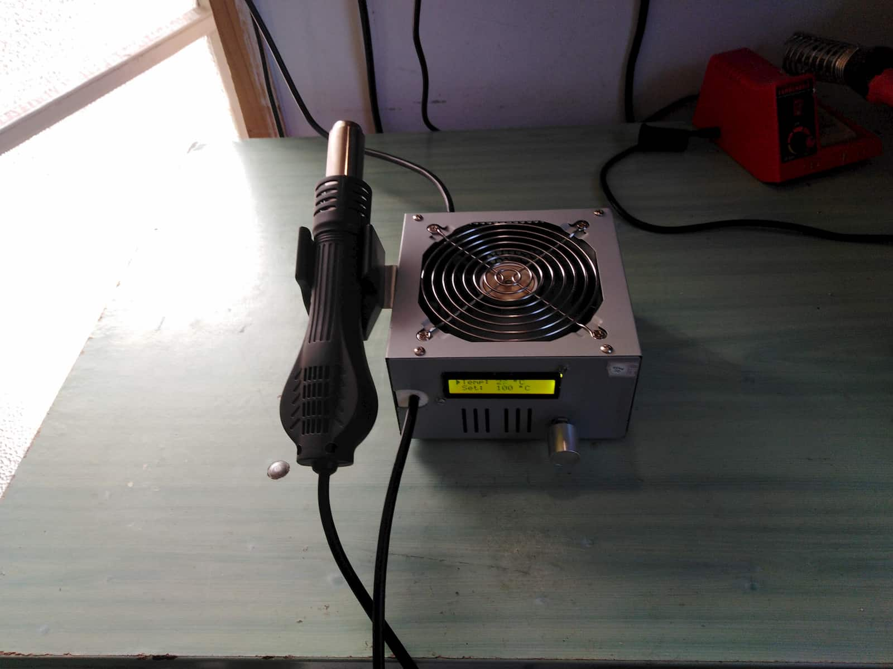
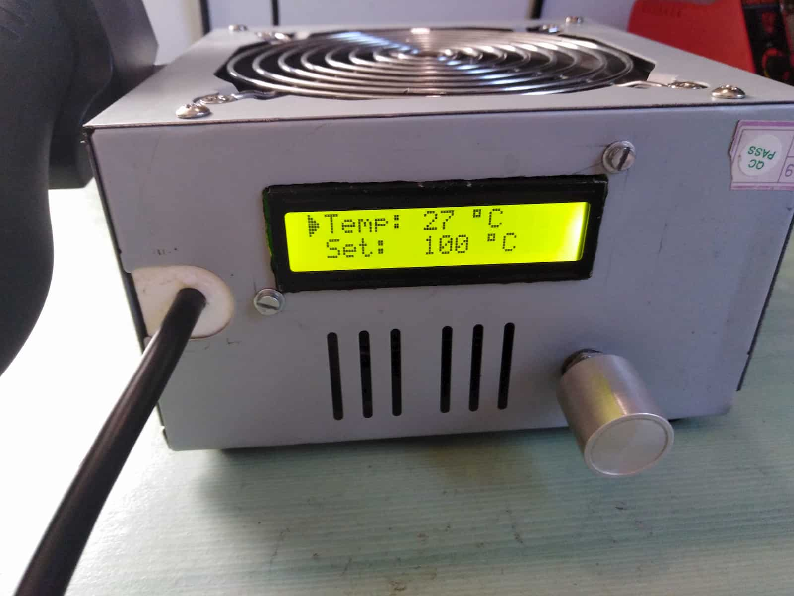
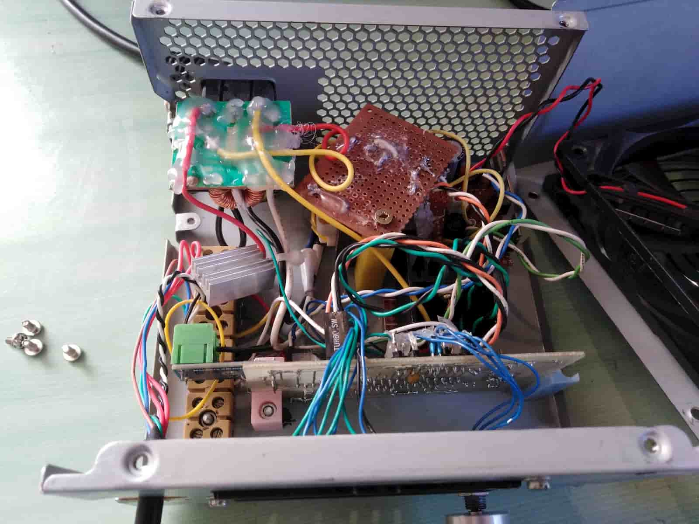
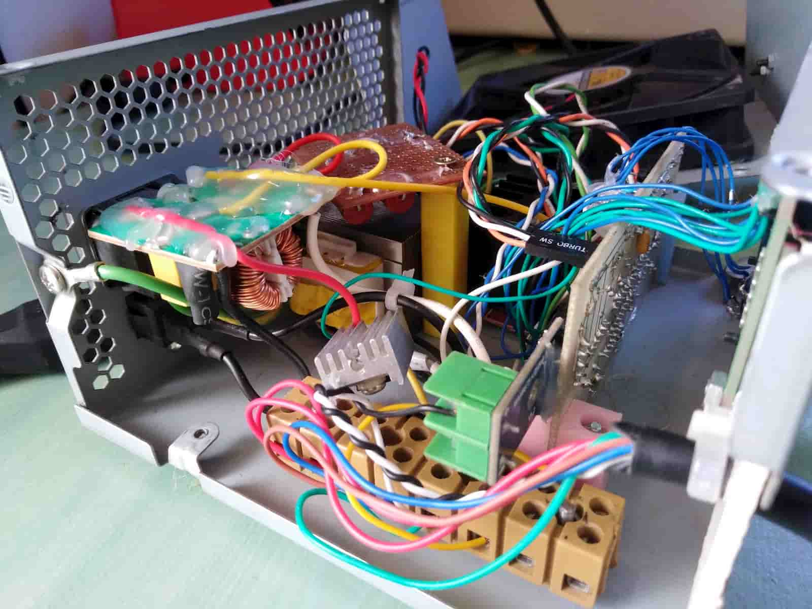

# Forrólevegős forrasztóállomás

## Linkek

- [forráskód](https://github.com/Sasszem/heat-gun-firmware)
- [kapcsolási rajz](https://easyeda.com/barath.laci10/heat-gun)

## Bevezetés

Egy másik projektem során, amikor pár száz darab SMD alkatrészt kellett (volna) beforrasztani, rájöttem, hogy kéne nekem egy ilyen. [Aztán megnéztem az árakat](https://www.ebay.com/sch/i.html?_nkw=858)...
A legolcsóbb verzió is 30k-ba került ahogy láttam (bár azóta mintha lentebb mentek volna az árak, vagy jobban tudok keresni, inkább 15-20 körül vannak az egyszerűbbek), ennyit meg nem akartam rászánni, főleg mert hirtelen rájöttem hogy akkora nagy szükségem nincs is rá. De elgondolkodtam, hogy mibe kerülne valami sajátot építeni...

Az indítólökést az adta, hogy az ebayen megláttam hogy az ilyen forrasztóállomáshoz pótalkatrésznek [lehet venni olcsón a "pákát"](https://www.ebay.com/sch/i.html?_nkw=+858+handle). Beépítve tartalmazza a fűtőbetétet, a ventilátort, a hőérzékelőt, de még egy reed-kapcsolót is a tartóállvány érzékeléséhez, kb. 5000 Ft-ért. Nem kell tehát mást építenem, csak egy 600W-os teljesítményszabályzót hőmérsékletvezérléssel és pár egyéb aprósággal.

## Áttekintés

A "pákában" a következők vannak:

- kb. 600W-os fűtőtest
- 24V-os egyenáramú ventilátor
- termoelem (J típusú)
- reed kapcsoló a tartóban lévő mágnes érzékelésére
- földelés a fémrészre

## Tervezés

### Nagy vonalakban

A fűtőszál 230V-ról megy (modelltől függően persze, jót kell rendelni), kb 600W-os, tehát valamivel kevesebb mint 3A-es. Váltakozóáramot szabályozni ekkora áramnál többféleképpen is lehet, én egy triakot használtam és fázishasítást. Utólag visszagondolva lehet hogy nem ez a legjobb megoldás, főként mert az először használt triak úgy melegedett hogy azzal lehetett volna forrasztani...

A motor vezérlése nem túl bonyolult, egy szimpla IRFZ44-es fet-et használok és persze a védő antiparallel diódát. A vezérlő 10kHz-s PWM-et használ (a frekvenciát vaktában választottam de működik).

A termoelemet elég jól elrontottam: feltételeztem (de ha jól rémlik valahol olvastam is) hogy K típusú, és egy MAX6675-ös IC-t terveztem, ami kb. mindent megcsinál egymagában, erősít, digitalizál, saját hőmérsékletét hozzáadja (a termoelem a két vége közötti különbséget méri), és az egészet elküldi SPI-on - csak éppen rossz lesz az adat, mivel a termoelem J típusú...

A reed kapcsoló a tartóban lévő mágnest érzékeli, de az egyik kivezetése közös a termoelem negatív kivezetésével. Egy felhúzóellenállás segítségével könnyen olvasható az értéke.

A vezérlőnek persze kell valamilyen kijelzés és bemenet. Kijelzőnek egy gyakori 16x2-es LCD-t használtam, párhuzamos 4 bites módban, inputnak meg egy rotary encoder-t.

A vezérlő lelke egy ATMEGA328P lett 16 MHz-n járatva (khm Arduino UNO khm). Órakristály + hozzávaló kondenzátorok, ISP csatlakozó, RESET gomb, és egy csatlakozó egy FTDI sorosport-USB konverternek került mellé első körben.

### Teljesítmény-szabályozás

Bármilyen ohmos fogyasztó, pl. fűtőszál teljesítményét lehet szabályozni, ha a feszültséget szabályozzuk. Mivel az ellenállás közel konstans, a `P=U^2/R` képlet szerint a feszültségtől függően négyzetesen változtathatjuk a teljesítményt. Az áramforrás feszültségének szabályozása helyett viszont célszerűbb az átlagos feszültséget állítani - például egy négszögjel kitöltési tényezőjének változtatásával - ezt nevezik impulzusszélesség-modulációnak (pulse-width modulation - PWM).

Egyenáram és teljesítménye:

PWM szabályozás és teljesítménye:

A motornál ez működik is, sőt, pontosan ezt csinálom, de a váltakozóáramú fűtőszálnál más a helyzet. Eleve, az átlagos feszültség 0 - de persze a teljesítmény nem. Az általam használt technika, a fázishasítás a PWM "kiterjesztése" váltakozó áramra - azaz a ki és bekapcsolt állapotok idejének szabályozása.

Váltakozó áram és teljesítménye:

Fázishasításos szabályozás és teljesítménye:

Az igen hülye ábra oka (már azon túl hogy nem rajzolok szépen) az, hogy a kapcsolóelem - a triak - elég körülményesen működik. Ha egyszer bekapcsolt, akkor amíg folyik áram, addig bekapcsolva is marad, akkor is ha nem kap már kapcsolójelet. Egyenáramra éppen ezért nem túl praktikus, de a váltakozó áramnál akárhányszor csomópont (nullátmenet) van, kikapcsol.

A teljesítmény a bekapcsolás megfelelő időzítésével szabályozható - minél később kapcsoljuk be a nullátmenet után, annál kisebb a teljesítmény. Persze az összefüggés nem olyan egyszerű mint a PWM-nél a négyzetes, de a tartományban szigorú monoton és folytonos, szóval simán használható, főleg ha negatív visszacsatolást használunk.

#### ZCD

Ehhez azonban a vezérlőnek tudnia kell, mikor megy át a feszültség a nullponton (mivel a fűtőszál gyakorlatilag tisztán ohmikus, nincs fáziseltérés a feszültség és áram között). Erre egy egyszerű áramkört építettem, a csomópont-érzékelő (zero-crossing detector - ZCD) egy egyenirányítóból, védőellenállásból optocsatolóból és felhúzó ellenállásból áll. A leden végig folyik áram, ami kinyitja a tranzisztort, és lehúzza az ellenállást 0V-ra. Amikor csomópont van, az áram 0, a led kialszik, és a tranzisztor is kikapcsol, a feszültség pedig 5V lesz.

Sajnos a ZCD kapcsolási rajza eltűnt a projektből:

### A vezérlés

A vezérlő többi része elég egyszerű, csak bekötöttem mindent egy használható lábra. A ZCD-t muszáj megszakításra kötni, míg a motorvezérlést PWM-es kimenetre. Minden más mehet egy-egy szabad lábra a vezérlőn...

A programkódot Arduino-ban írtam, felhasználva az alap LCD könyvtárat, egy [MAX6675 könyvtárat](https://github.com/adafruit/MAX6675-library) és [ezt a cikket](https://www.best-microcontroller-projects.com/rotary-encoder.html) a rotary encoderhez. Igyekeztem mindent átláthatóra írni, remélem hogy sikerült...

A menüt egy külön headerbe raktam az átláthatóság kedvéért.

A legnagyobb kihívás a sok különböző dolog párhuzamos kezelése volt:

- ZCD impulzusok után **időzítve** gyújtani a triakot
- rotary encodert figyelni és reagálni
- termoelemet beolvasni
- reed kapcsolót beolvasni

Egy pár órám ráment a hibajavítgatásra (különösen a triakvezérlésre - volt egy csúnya `Integer Underflow`-om amit egy interrupt miatti [TOCTUE](https://en.wikipedia.org/wiki/Time-of-check_to_time-of-use) okozott...)

A program igyekszik korrigálni a termoelemek összekeverése miatti hibás adatokat is.

A hőmérséklet-vezérlés jelenleg elég primitív, sima ki-be kapcsolós rendszerű, ezen előbb-utóbb (pár éven belül) fogok javítani (*valószínűleg*), mert olyan 20-30 °C-os oszcillációt okoz a célhőmérséklet körül.

## Konstrukció

Szépen sorban modulrendszerben teszteltem az egyes részeket, a motorvezérléssel kezdve a teljesítményelektronikán át a vezérlőig. Amikor mindent kipróbáltam és működni látszott a legtöbb dolog, nekiálltam megtervezni a nyák-okat és keresni egy készülékdobozt.

### A doboz

A legtovább doboz kiválasztása tartott, végül egy meghibásodott PC tápegység dobozába építettem be az egészet. Eredetileg túl nagynak gondoltam, de végül éppen csak belefértem. Külön bónusz volt a 12V-os beépített ventilátor, ami nem hogy megoldotta a triak melegedését de már félő volt hogy kifújja az alkatrészeket a dobozból... Be van még építve egy szabványos tápcsatlakozó és kapcsoló is, amit szintén felhasználtam.

Az elejére vágtam egy lyukat az LCD-nek (lőjenek le ha még egyszer ilyet akarok csinálni), illetve fúrtam egy lyukat a rotary encodernek. A legvégén kapott pár gumilábat és egy műanyaglemezt a lyukra ahol kijön a kábel mint végső simítás.

### Panelek

A vezérlő panele saját tervezésű NYÁK. Egyoldalas, így házilag legyártani sem nehéz, és csak THT alkatrészeket tartalmaz, így összeállítani sem. A MAX6675-öt egy "breakout bard" formájában építettem be. A panel elég sok átkötést használ.

A többi modult próbanyákokra építettem fel, egy kis előzetes átgondolás után, így tervrajzaim nincsenek.

### Tápellátás

A készüléknek 3 különböző tápfeszültségre van szüksége:

- 5V a vezérlőnek
- 12V a hűtőventilátornak
- 24V a pákában lévő ventilátornak

Összesen sem kell ezeknek 1A sem, úgyhogy egy kis 24V-os trafóból építettem tápegységet 3 LM78XX stabilizátorral. Még hűtőborda sem kell nekik...

### Csatlakozások

A páka bekötésére egy sorkapcsot szereltem be, így könnyen kiköthető ha szükséges. A további bekötéseket igyekeztem mindenhol csatlakozóval megoldani, hogy bontható legyen, de a 230V-os vezetékek (a sorkapocs kivételével) mind forrasztva vannak. A vezérlőt és az LCD-t, illetve enkódert összekötő vezetékek szintén forrasztva vannak, és ragasztópisztollyal tehermentesítve.

### Felépítés

A legtöbb kisebb panelt, illetve a transzformátort ragasztópisztollyal rögzítettem a doboz aljára - ügyelve hogy a fémdoboz nehogy rövidre zárja őket.

A sorkapcsot és az LCD-t csavaroztam, az enkódert pedig a saját leszorító csavarjával rögzítettem. A doboz oldalára a pákatartó szintén csavarozva lett.

A vezérlő paneljét színesrudakkal rögzítettem, amelyeket szintén csavaroztam. A vezérlő (a kábelek lecsatlakoztatása után) egyszerűben kiemelhető, de az újraprogramozáshoz elég egy kicsit kintebb húzni.

A ZCD paneljének már nem jutott hely a doboz alján, így azt egy távtartóként használt színes rúdra csavaroztam, amit szintén csavarral rögzítettem a doboz aljára.

### Hűtés

Az egyetlen ténylegesen hűtésre szoruló alkatrész a triak, amely egy méretes hűtőbordát kapott. A motort kapcsoló FET is kapott egy kisebbet, bár nincs rá szüksége. A hűtőbordák és alkatrészek közé mindenképpen kell szigetelés! A feszültségstabilizátorok teljesen jól megvannak hűtés nélkül. A dobozba beépített ventilátor gondoskodik a megfelelő légáramról, egyszer sem voltak túlmelegedési gondjaim.

### Hálózati feszültség

A vezérlés **HÁLÓZATI FESZÜLTSÉGET KAPCSOL**. Utánépítését nagyon nem ajánlom kezdőknek, mert nem kellemes belenyúlni (kipróbáltam, tényleg nem), adott esetben halálos is lehet! Én is rendesen be vagyok tőle tojva, éppen ezért amint lehetett minden esetlegesen szabadon lévő és megfogható pontot ahol előfordulhat hálózati feszültség, leszigeteltem ragasztópisztollyal.

Mind a triak, mind a ZCD optocsatolóval van építve, azaz galvanikusan izolál, nem kerülhet hálózati feszültség a vezérlőre. A panelek is ennek megfelelően vannak építve, minimalizálva az átütés veszélyét. A doboz és a páka fémrésze földelve van, így (megfelelő elektromos hálózat esetén) nem érhet áramütés ha megfogjuk (bár a páka igen forró tud lenni úgyhogy inkább ne fogdossuk)!

## Utánépítés

Ha lehet inkább ne!

Tartalmaz pár tervezési hibát (leginkább a termoelemnél), nem túl elegáns, nem tud mindent a program és a mechanikai felépítés is igen hülyére sikeredett. Ha elromlik, egyszerűbb lesz újat építeni mint szétszedni...

Kiindulási alapnak egy sajáthoz viszont jó, ezért is rakom ki amit csak lehet, illetve álljon itt egy lista a javítandó hibákról:

- **a termoelem NEM K típusú!**
- triak helyett lehet hogy célszerűbb lenne FET-et használni
- a tápellátást lehet hogy meg lehetne oldani egy kisebb kapcsolóüzemű tápegységgel is
- a ZCD-ből lehet kisebbet és energiatakarékosabbat építeni
- a motorvezérlés valamiért nem érződik megfelelőnek
- jobb lenne egy nagyobb NYÁK-ot építeni sok kisebb helyett
- a programkód elég randa
- **a termoelem NEM K típusú!**
