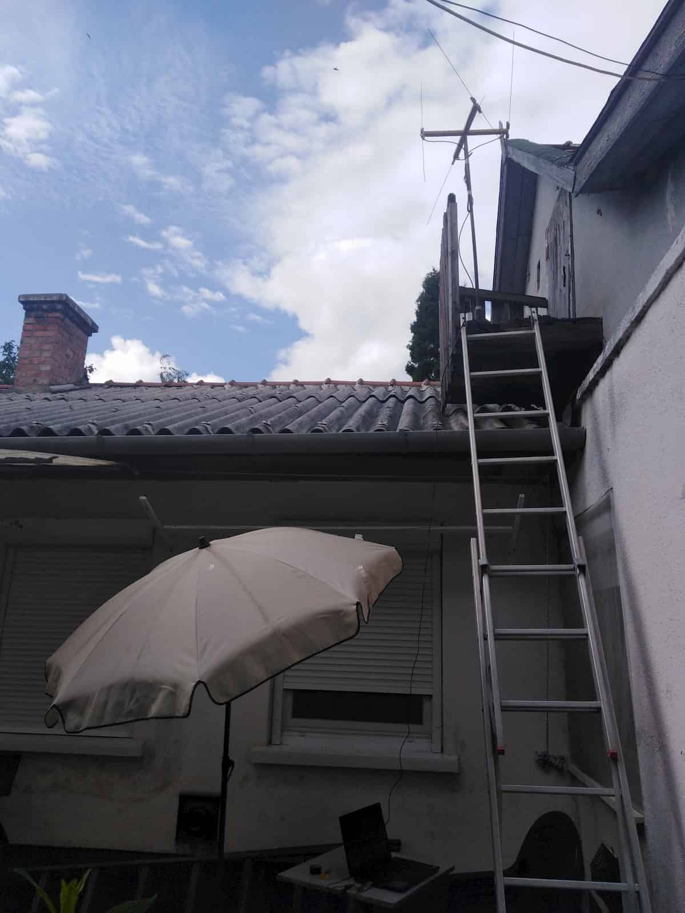
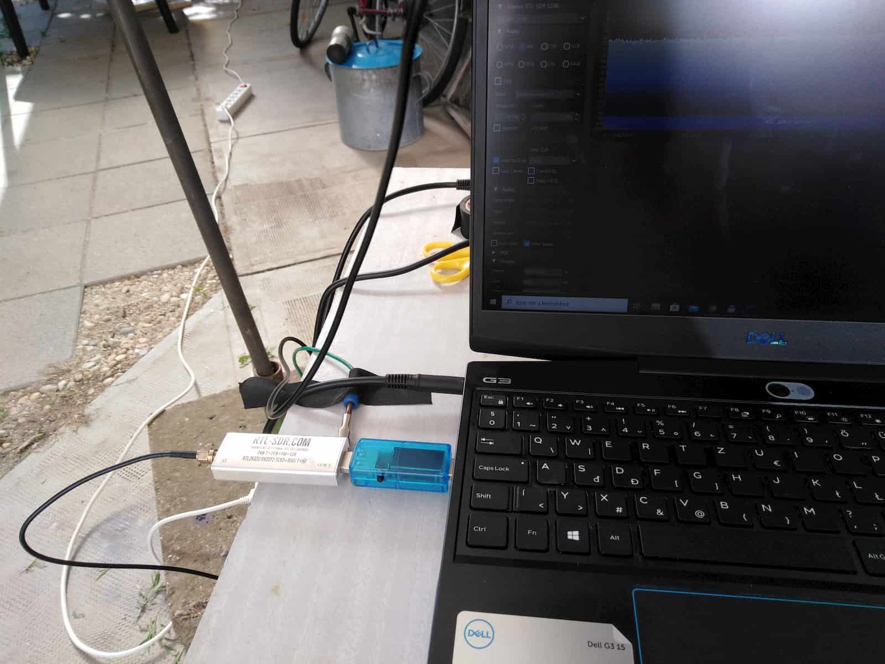
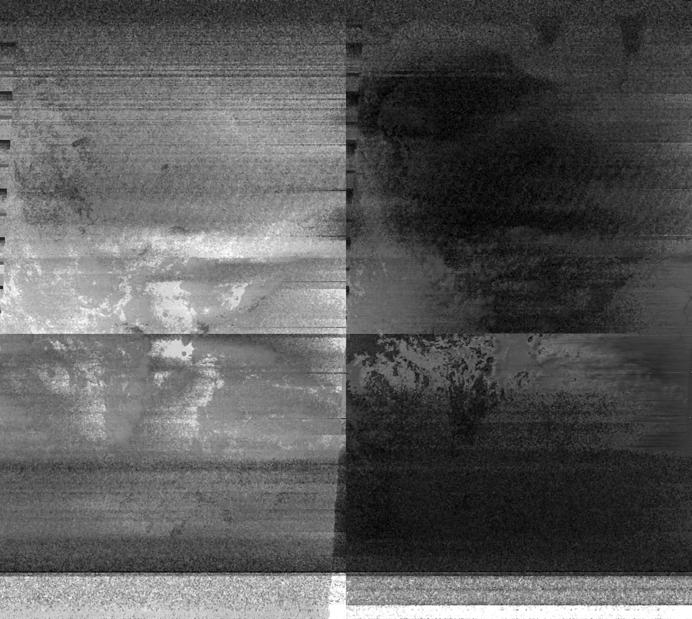

# Meteorológiai műholdadás vétele

[Vissza](../elektro.md)

Az egyik első a videó amit a [The Thought Emporium](https://www.youtube.com/channel/UCV5vCi3jPJdURZwAOO_FNfQ)-tól láttam a [műholdvételi projektet](https://www.youtube.com/watch?v=cjClTnZ4Xh) mutatott be. Megtetszett az ötlet, és úgy gondoltam, megpróbálom megcsinálni én is.

## Műholdak

Az amerikai NOAA meteorológiai műholdak `137 MHz`-n adnak egy `APT` kódolású adást - lassú képátvitel szélessávú FM modulációval, körpolarizált adás formájában.

Büszke vagyok arra hogy értek néhány szót az előzőből...

## SDR

A lényeg, hogy nagyfrekvenciás rádióvevő kell, amivel összetett modulációs formákat is tudok dekódolni. Persze megpróbálhatnék építeni is egy saját FM demodulátort, de az elég bonyolult és nem hiszem hogy egyhamar sikerülne - bár fent van a listámon. A linkelt videóban egy HackRF-et használnak - egy SDR-t azaz szoftveres rádiót. Elég okos cucc, digitalizálja a rádióadást és egy megfelelő programmal gyakorlatilag bármilyen moduláció dekódolható. Persze az ára is olyan...

Egy olcsóbb verzió az RTL-SDR. Igazándiból nagyon ügyes hack, egy USB-s TV-vevőt átalakítva meglepően nagy teljesítményű vevőhöz lehet jutni, és készülnek direkt erre a célra áttervezett példányok is. Az áruk jóval alacsonyabb mint a HackRF-é, de persze limitáltabb, kisebb a sávszélessége, és nem képes adásra se. A [reklámanyaguk](https://www.rtl-sdr.com/wp-content/uploads/2018/02/RTL-SDR-Blog-V3-Datasheet.pdf) eléggé meggyőző, beruháztam egybe. Az én verzióm SMA-s dipólantennával mellékelve jött.

## Első próbálkozás

A műholdadás vételét először a mellékelt antennával próbáltam meg, amit a méretezésével hangoltam 137 MHz-re. *VALAMILYEN* jelet sikerült is fognom, de nagyon zajos volt, használhatatlan. Nehezíti a dolgot hogy a műhold csak 5-15 percig látható az égen egyfolytában.

## Antenna

A jobb vételhez külön antennát ajánlott építeni. Ehhez a műholdhoz duplakereszt-dipólt javasolnak (double cross dipole). Ez eléggé irányérzéketlen, azaz nem kell folyamatosan a műholdra irányítani. Cserébe a nyeresége sem olyan nagy mint egy irányérzékenynek. Az építéshez ezt a leírást vettem alapul, de nem egyszer a saját igényeimhez igazítottam.

## Vétel

Az új antennát elhelyeztem egy magas ponton, rákötöttem az SDR-t és vártam a műholdat. Nem igazán fogtam be elsőre semmit, de a második időpontra beszereltem egy olcsó 30dB-s erősítőt amit az ebay-ről rendeltem. Ezzel már egészen jó jelet fogtam, de az SNR (signal-noise-ration, jel-zaj arány) még mindig nem az igazi, így a kép is elég zajos lett.

Antenna magasan elhelyezve:

RTL-SDR & laptop:

## Dekódolás

Az FM-demodulált adást fel kell venni, én erre az SDR# programot használtam. Újra kell mintavételezni a használt program miatt (Audacity-vel oldottam meg), majd odaadni a WxtoIMG-nek, ami elvégzi a többit. Sajnos a kép elég zajos lett, hátha sikerül tisztább felvételt csinálnom.

Felvett adás:

Dekódolt kép:

## Továbbiak

Az erősítő elhelyezése nem optimális, jóval közelebb is el lehetne helyezni az antennához. Ezzel és az elhelyezéssel valószínűleg jelentősen javítható a zajos kép.

Még pár másik műhold is ad ezen a frekvencián, főleg az orosz Meteor-M2-t szokták még vadászni.

Még jó sok egyéb dolog van amit egy RTL-SDR-el lehet csinálni, például szívesen építenék QS-100 vagy GEOS downlinket is, ha már műhold...

[Vissza](../elektro.md)
