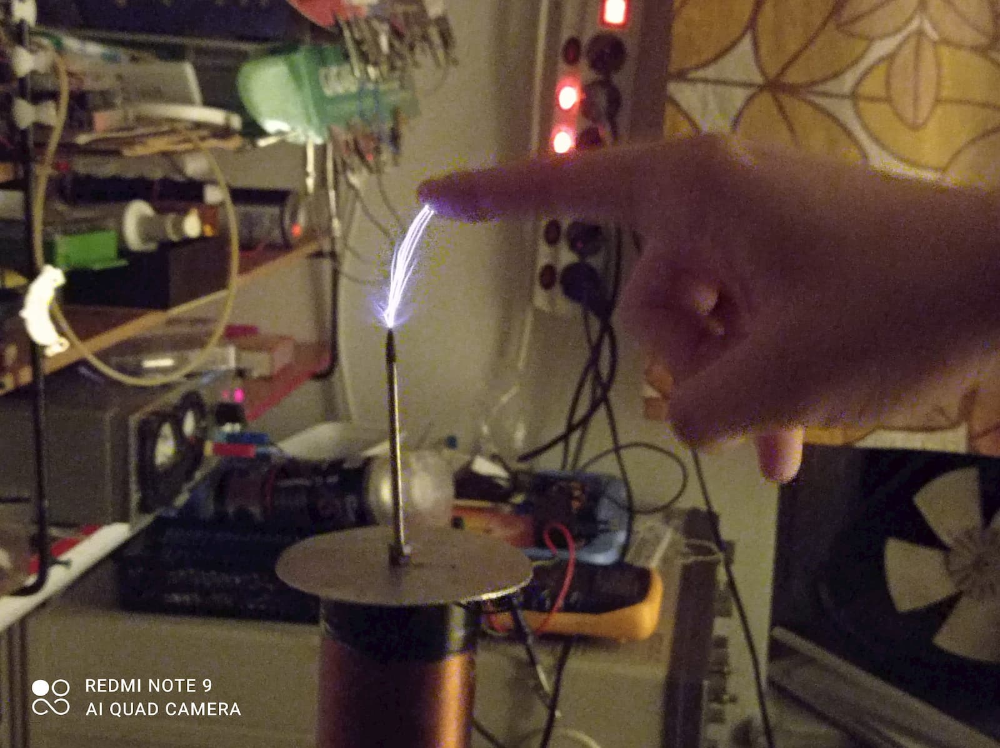

# Skori féle miniteslám - 2016 nyara

[Vissza](../elektro.md)

A [miniatűr tesla-tekercs](slexciter.md) után építeni akartam egy nagyobbat, de legfőképpen látványosabbat. A legtöbb design viszont nem éppen kezdőbarát, de valahogy rátaláltam [Skori verziójára](http://skory.gylcomp.hu/tesla/mini_tesla.html), ami egészen látványos, nem veszélyes, és megépíteni sem túl bonyolult.

A projekt legunalmasabb része egyértelműen a szekunder megtekerése volt, 1000-2000 menetet elég monoton szorosan egymás mellé tekerni egy PVC-csőre. Nem véletlen egybeesés hogy ezen a nyáron néztem meg a `Star Trek: TNG` összes részét...

Az áramkörhöz Skori kapcsolási rajzot, NYÁK-tervet és alkatrészlistát is mellékelt. A NYÁK-tervvel sajnos nem tudtam mit kezdeni (beültetési rajzzal egyesített kép formájában), viszont a kapcsolási rajz (no meg az alkatrészek kikeresett lábkiosztása) alapján egy darab próbanyákra egészen könnyen megépíthető volt. 

Extrának (mivel huzamosabb működés után igencsak melegedni kezdtek a FET-ek), beszereltem egy kis ventilátort és hozzá egy 7809-es stabilizátort hozzá.

A mechanikai felépítés elég egyszerű volt, a doboz eredetileg talán egy telefonközponté volt. Sok ragasztópisztoly és pár csavar az egész.

A szekundert sikerült sajnos párszor majdnem tönkretennem, de sikerült mindig kijavítani, és inkább lelakkoztam jó erős lakkal, így már majdhogynem gránátbiztos.

Videók a tekercsről:

<iframe width="1519" height="554" src="https://www.youtube.com/embed/oZT6QXziXcY?list=PL3dDFVdDb7vh95_omY0aDy_FbhAy9EHl2" frameborder="0" allow="accelerometer; autoplay; encrypted-media; gyroscope; picture-in-picture" allowfullscreen></iframe>

<iframe width="1519" height="554" src="https://www.youtube.com/embed/gpOH-WP2XgM?list=PL3dDFVdDb7vh95_omY0aDy_FbhAy9EHl2" frameborder="0" allow="accelerometer; autoplay; encrypted-media; gyroscope; picture-in-picture" allowfullscreen></iframe>

<iframe width="1519" height="554" src="https://www.youtube.com/embed/T2JvNp0kqoA?list=PL3dDFVdDb7vh95_omY0aDy_FbhAy9EHl2" frameborder="0" allow="accelerometer; autoplay; encrypted-media; gyroscope; picture-in-picture" allowfullscreen></iframe>

[Vissza](../elektro.md)