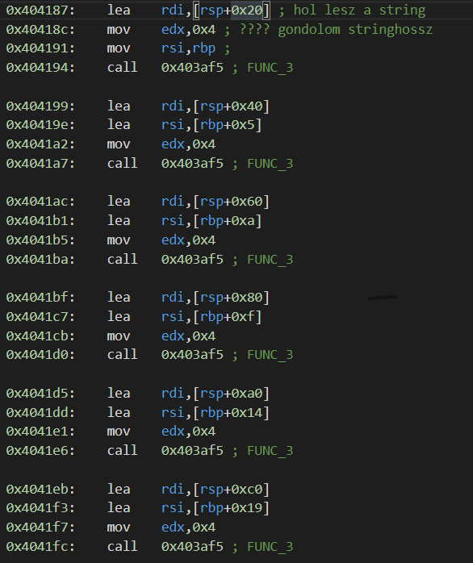

# babypk - egy izgalmas CTF challenge

[Vissza](../prog.md)

## Kis bevezető

A Schönherz Kollégiumban működő *Kollégiumi Számítástechnikai kör* (KSZK) *SecuriTEAM* csoportja által szervezett 2020-as "hackerversenynek" (wargame) idén két győztes csapata volt holtversenyben, mivel minden feladatot megoldott: **c0r3dump**[[ctftime]](https://ctftime.org/team/65521
)[[twitter]](https://twitter.com/c0r3dumpCTF
) és **Sasszem**. Utóbbit  alkottuk mi ketten KosmX barátommal (aki szintén villanyos gólya). 

A beadási határidő után a verseny Discord szerverén megkérdeztem hogy ki a **c0r3dump**, és az [egyik csapattagjuk](https://twitter.com/0xdt0
) rámírt. Ha jól értem a történetet, akkor elég nagy játékosok, sőt, saját versenyt is szoktak szervezni a témában, enyhén szólva nem egy ligában vagyunk velük (és részben ezért is nem értem hogy hogyan keveredtek erre a versenyre). Küldött viszont a srác akivel eldumáltunk egy pár feladatot amit ők találtak ki...

Még volt egy kis erőm a verseny után, így az egyiknek nekifogtam. Elég gyorsan kiderült viszont hogy jóval összetettebb mint a KSZK-s feladatok voltak...

## Writeup

### Információgyűjtés

Bedoobtam a discordon átküldött file-t WSL-be, majd nyomtam rá egy `file`-t:

Tehát egy 64 bites linux binary (~exe file), dinamikus linkeléssel. Eddig nem feltétlen para...

"`stripped`" na ez viszont már érdekesebb, nem tartalmaz szimbólumokat, azaz kitöröltek belőle majdnem minden információt arról hogy mi hol van benne, nekem kell újra összeraknom (és elneveznem) mindent. Elég egyszerű ámde hatékony módja hogy megnehezítse a visszafejtést...

Indítsuk el a programot:


Aranyos. Szép animált kiírással feltesz egy eldöntendő kérdést.
Két tippből el lehet találni hogy a *"no"* választ várja (bármi másra kilép), és folytatja:


Habár itt is egy eldöntendő kérdésünk van, sajnos sem a *"no"*, sem a *"yes"* választ nem fogadja el, hanem kilép. További próbálkozással sem jutottam tovább ezen a fronton...

## Elemzési kísérletek

Bár látszólag egyértelmű a legtöbb amit csinál, mégis érdemes lehet megnézni hogy milyen függvényhívásokat csinál a szabványkönyvtárba. Futtattam hát egy `ltrace`-t rajta:


No hát ez kérem egészséges. Összeomlott a program!

Tekintve hogy ilyet korábban nem tett, gyanús hogy nem akarja hogy így elemezzem és ezért nyírta ki magát...

A másik megfigyelés hogy még ez előtt sincs egyetlen egy sor sem arról hogy bármilyen függvényhívás történt volna a szabványkönyvtárba, ami azt jelzi hogy ezek nélkül derítette ki valahogy hogy éppen próbálom nyomonkövetni...

Ha megpróbálom az operációs rendszer hívásait követni (`strace`), kicsit hosszabb eredményt kapok, de ez is összeomlik végül...

A legtöbb dolog innen elég haszontalan, de feltűnhet ez a sor:
```
open("/proc/self/status", O_RDONLY)
```
Azaz megnyitja olvasásra a `/proc/self/status` file-t. A `/proc/` egy linuxos pszeudo-filerendszer, a futó folyamatok adatait tartalmazza, amiket így lekérdezhetünk vagy módosíthatunk. Gyanús hogy innen kérdezi le valahogy hogy éppen debugolva van-e...

Kipróbáltam gyorsan Python-ban, beolvasni ezt a filet ha magában indítom el a python-t, vagy ha ltrace-el, és fel is tűnt a különbség:
```
TracerPid:      334
```
(a két oszlop között tab van)
Ebben a sorban alapból 0 van, így viszont egy másik szám...

Esetleg még megpróbálhatnánk nyomonkövetni a történéseket `GDB`-vel is:


Hasonló hibajelenség, a program kardjába dőlt...

### Visszafejtési kísérletek

Nosza, dobjuk be a programot Ghidra-ba!

Elég sokáig darálta, végül csak belenézhettem, de nem volt benne sok köszönet. Elég gyorsan (úgy negyed-fél óra alatt) úgy döntöttem hogy ez nem lesz így jó...

Mivel GDB-vel sem mentem sokra ebben a formában, ráeresztettem egy másik eszközt amit valamennyire ismerek: `Cutter`. Ez az `r2` nevű decompiler egy grafikus felülete (mivel az r2 amúgy parancssorban fut és igen hülye nevű parancsokkal irányítható).

Ezzel már jutottam valamire, beazonosítottam hogy hol és hogyan keresi meg a `TracerPID`-t a `/proc/self/status`-ban, és ha nem 0, hogyan lép ki.

Pár feltétel patchelése után azt hittem sikerül ezután jobban belenéznem, de sajnos csak egy kicsivel lett jobb a helyzet:


`GDB`-vel sem lett jobb:


Ellenben `strace`-el már működik, nem omlik össze (bár ezt élesben nem próbáltam ki, csak így utólag ahogy írom jöttem rá):

Innen megtudhattam volna pár dolgot:
- A `/proc/self/status` ellenőrzése után megnyitja (nem is egyszer ráadásul) a `libc-2.31.so`-t, illetve sok `mmap`-ot csinál (gondolom a libc betöltéséhez)
- sok `nanosleep`-et csinál felváltva a `write`-el, azaz így ír ki lassan
- gyakran előfordulnak `SIGSEGV`-k azaz segfaultok, de ezektől nem omlik össze

Az utolsó kivételével mindegyikre rájöttem más úton, és azt is elárulták miután megoldottam a feladatot.
(direkt csinál segfaultot, olyankor tölti be a letitkosított bináris egy új részét...)

Egyszóval a "rádobok-egy-eszközt-és-az-majd-visszafejti-nekem" módszer erősen nem vált be, egy darab védelmi mechanizmust találtam meg vele, amúgy elég salátát generáltak.

### Visszafejtés okosan

Szóval a process indulások ellenőrzi hogy nem debugolják-e és kilép / összeomlik ha igen?

Na de vajon mi történik ha az elején nem, csak utána kezdjük nyomonkövetni? Lehet hogy így megkerülhetem a védelmét, esetleg már a kititkosított részbe is belenézhetek? (még csak sejtettem hogy titkosítva van a lényeg, de tudtam a cutteres próbálkozásból hogy olyan memóriákra ugrik amik alapból üresek).

`GDB`-t lehet futó folyamathoz is csatolni `-p`-vel:
```bash
gdb -p `pidof babypk`
```

Siker!
A program megáll, és szabadon szétnézhetek a memóriájában!


Na de mit érdemes megnézni? Hol a lényeg?

Azt már tudom hogy éppen hol tartott a végrehajtás, no de hogyan jutott oda?

Ha a függvényhívások követik a megszokást, azaz a visszatérési címet a stack-re rakják,  akkor megtudhatjuk a `backtrace` paranccsal:


Több információt kaptam mint reméltem volna, mert a `__libc_start_main` függvény alapján még a `main` függvényt is megtalálta!

Sajnos a binary még mindig stripped, szóval sem a `disas main`, sem a `disas *0x403e6d` nem működik.

Működik viszont a `x/64i 0x403e6d`:


Sajnos az `AT&T`-s assembly szintaxist nem ismerem jól, de szerencsére a `GDB` tud `Intel`-est is, csak kérni kell: `set disassembly-flavor intel`


Innen már könnyű elindulni...

### Függvények felderítése

Ha van egy függvénycímem, akkor `GDB`-ben `x/i`-vel ki tudok olvasni utasításokat. Sajnos viszont a függvény vége nem egyértelmű ránézésre, de nem is nehéz megtalálni.

Egy függvény amit `call` utasítással hívtak, mindenképpen `ret`-el ér véget. De nem biztos hogy az első `ret` rögtön a függvény végét jelzi, mert lehetnek előtte (feltételes) ugrások, amelyek átugorják. Éppen ezért mindent addig a `ret`-ig olvastam ki amelyiket már nem ugorja át soha a program.

Ilyen módon megszereztem a teljes `main` függvényt, és elmentettem egy fileba.

A `main` viszont hív más függvényeket, ezek címét is vissza lehet keresni hasonlóan és a függvényt elmenteni fileba, majd az azok által hívottakat is, és így tovább...

Néhány függvény `libc`-s függvény, ezeket szerencsére a `GDB` be tudja azonosítani:


Elkezdtem a függvényhívásokat (`call` utasításokat) kommentelni, hogy hova mutatnak, illetve a `grep . -r -e "call" | grep -v ";"` paranccsal olyan `call` utasításokat keresni amik mellett még nem szerepel komment...

Ilyen módon a `main` mellett 12 új függvényt azonosítottam és mentettem fileba...

### A függvények elemzése

([A fileok, amelyeken dolgoztam](disas.zip))

Természetesen a sok függvény közül a rövidebbekkel kezdtem a munkát.
Követtem a változók, regiszterek tartalmát, azonosítottam és elneveztem az ugrási pontokat, és baromi sok kommentet írtam mindenre. 

Az egyik legrövidebb függvény az általam `FUNC_7`-nek keresztelt volt, amely csak néhány számot töltött be egy pufferbe amit megkapott.
Ennek jelentőségére csak később jöttem rá...

A `FUNC_11` és `FUNC_12` elég hülye függvények voltak. Sok bitművelet, sok regiszter felhasználása, de egy kis elemzés után rájöttem hogy mindkettő 4 byteos blokkokkal dolgozó `memcpy`. Biztos ami biztos alapon kimásoltam azért őket és írtam egy tesztprogramot amivel ellenőriztem...

A `FUNC_5` elég érdekes példány volt, de viszonylag egyértelmű volt hogy egy string hosszát határozza meg...

`FUNC_6`-ban volt egy `syscall`. A kódból kiderült a száma, és visszakeresve kiderül hogy `nanosleep`-et valósít meg. Őt csak `FUNC_1` hívja.

`FUNC_1` `putchar`-t és `FUNC_6`-ot hívja felváltva egy ciklusban - ő írja ki lassan a stringeket.

`FUNC_2` egy érdekes példány, egy memóriacímet hív, de őt nem hívja senki (csak éppen a backtrace-ben szerepelt egyszer). A pontos céljára nem jöttem rá azóta sem.

### A puzzledarabok összerakásának eleje

A `main`-t is elkezdtem elemezni, bár majdnem a leghosszabb volt minden függvény közül. Elkezdtem felírni a stack szerkezetét is.

Pár lassú print után (amelyek forráscímét beazonosítottam mint az elején látott szövegek), a stack-en létrehozott globális változóba kezd írni, majd C++-os függvényeket hívni - nevezetesen `operator>>`-t `cin`-en. Ez tehát a beolvasás...

Elég sok időmbe telt mire rájöttem hogy hogyan működik viszont a string objektum a stack-en: címet és hosszt tárol. Címnek alapból egy (azt hiszem 16 byte hosszú) puffert használ a stack-en, de mikor módosítjuk, a módosítófüggvények ehelyett foglalhatnak újat, a régit pedig felszabadítják. Emiatt a string törlése csak akkor szükséges ha újrafoglalta a memóriát - ez alapján jöttem erre rá.

Szóval beolvas egy stringet `cin`-ről, majd egy compare - a forráscím a "no" string - ez tehát az első ellenőrzés...

### A második ellenőrzés

Újabb sok-sok lassú print, újabb beolvasás (ugyan abba a stringbe) - eddig semmi különös.
Ezután meghívja `FUNC_4`-t, majd 16 byteot összehasonlít egy általa tárolt 16 byteal.

`FUNC_4` hívja `FUNC_7`-et, `FUNC_8`-at és `FUNC_10`-et, `FUNC_8` pedig `FUNC_9`-et.

A hosszabb függvények eléggé salátásak, illetve `FUNC_9` lehetetlen mennyisgű bitműveletet tartalmaz. Elkezdtem őket visszafejteni, de nem sokra jutottam.

Egy nap szenvedés után egyszer csak valamiért rákerestem a `FUNC_7` által betöltött egyik számra.

Bingó! MD5 kezdeti állapotának egyik része volt...

Akkor valószínűleg az egész `FUNC_4` nem csinál mást mint MD5-öt számol a beírt stringből, majd ezt az MD5-öt hasonlítjuk össze a tártolttal...

Megvolt hát hogy minek kell kijönnie, már csak vissza kéne fejteni az MD5-öt.

Sajnos ez nekem nem ment, `hashcat` egy órán keresztül pörgött rajta, nem találta meg.
KosmX-nek is elküldtem, de aki a feladatot küldte is elárulta a megoldást (amit KosmX 5 perc alatt magától is megtalált, egy online MD5 visszakeresővel): `M47r1X`

Ez "mátrix" akar lenni, csak éppen 1337. Kérés hogy melyik mátrix - a lineáris transzformáció vagy a film amelyikben az informatikus fejberúgja az "efbíájost"...

Kipróbálva ezt a bemenetet a program újabb szöveggel fogad:


Na jó, hazudtam, egy percig sem merült fel bennem hogy ne a filmre gondoljon...

### A harmadik ellenőrzés

Azt hiszem nem nagy meglepetés, hogy itt megint csak egy statikus ellenőrzés van a `"2"` stringgel...

### És a végső csata...

No de az utolsó!


Viszonylag hamar kiszúrtam ezt:


Szóval kiír valamit gyanúsan flag formátumban

Kis elemzés után viszont kiderült hogy nem mást ír ki mint amit beírtam, de csak ha az teljesít néhány feltételt.

Van a programban pár feltételes `delete()` hívás. Ezekből kiderítettem hogy `C++`-s `basic_string` objektumokhoz tartoznak. Ezek összetett objektumok, amelyek tartalmaznak egy `size` méretet és egy `char*` pointert az adatokra. A hozzá való függvények automatikusan foglalnak új memóriaterületet ha a jelenlegi nem lenne elég. A `delete()`-k azért vannak feltételekhez kötve, mert az alap lefoglalt memória a stack-en van, és ha ez nem változott meg, akkor ezeket nem lehet felszabadítani.

Ami ebből fontos hogy megvan néhány string objektumom a stack-en.

A következő inputom feldolgozása elég sok és érdekes lépésből áll.


Először is ugye beolvassa egy `std::string` objektumba. Beolvasás után ellenőrzi a hosszát - 29 karaktert kell beírnunk.


Először is egy ellenőrzés. Minden karaktert megnéz, és ha érvénytelent talál, akkor kilép azonnal. Érvényes az `A-Z`, `0-9` és `\n`, `-`. Utóbbiakat egy elég érdekes módon csinálja, egy 64 bites számot használ mint bitmaszk, az i. kódú karaktert átengedi ha az i. bit 1-es a számban. Ügyes trükk, eltartott egy darabig mire megfejtettem...


Ezután egy egyszerű formátumellenőrzés. Az 5. 10. 15. 20. és 25. karaktereknek `'-'`-nek kell lenniük.
Ez alapján a formátum `AAAA-BBBB-CCCC-DDDD-EEEE-FFFF` lesz.

Ezután szétszedi 6 részstringre (a 6 4 betűs bemenet alapján), de még végez rajtuk valami extrát is...


A végrehajtott függvény működését dinamikus analízissel fejtettem meg, ugyanis kódolás után megnézve a sztringek tartalmát, az eredeti bemenetemet láttam viszont `Base64`-ben kódolva...

Na és ezután jött az egyes B64 kódolt sztringeken több képernyőnyi saláta, sok bitművelettel, matekkal és néha pár look-up table bevonásával...

A lényeges megállapítások:
- 6 külön kódolás a 6 részsztringre
- minden kódolás csak az adott karakteren dolgozik

Ez azt jelenti, hogy 6db `tiszta függvény`-ünk van, mint kódolófüggvény, azaz a kódolás kimenete csak az adott karaktertől függ (illetve adott esetben egy read-only lookup-table-től). Ennek egy fonos következménye, hogy készíthetünk egy-egy táblázatot minden kódolásból, amivel felváthatjuk az egészet. Egy ilyen táblázat nagy előnye, hogy nagyon könnyű benne visszakeresni, hogy mi volt a bemenet, amiből az adott kimenetet kaptuk - tehát nagyon könnyen vissza is fejthető az egész.

Ezek táblázatok kigenerálásához a kódoló "függvényeket" kimásoltam, és csináltam köréjük egy függvény-keretet, aminek a segítségével újra meg újra meghívhatom őket. Ezeket a függvényeket (persze mellékelve a look-up table-eket is adott esetben) [egy külön assembly file-ba raktam.](functions.asm)

Ez exportálja a hat kódolófüggvényt, amit így már használhatunk is...

Az eredeti kódban elég egyszerű megtalálni hogy mivel hasonlítja össze a hat eredményt:


Szóval már csak az a kérdés, hogy mit kellett lekódolni hogy ez jöjjön ki...

A megfejtéshez [összedobtam egy python-programot.](solver.py)

Ez betölti az assemblyben írt shared object-et, aminek a függvényiből sorra felépíti a táblázatokat (rögtön fordítva a visszakereséshez), aztán visszakeres. Az eredményt kiírja, B64-dekódolja, és a végén össze is fűzi nekünk...


`Holy shit, nice unpack bro`

"És még Ő mondja hogy 'Holy Shit'?!"

## Összefoglalás

Alig 3-4 napig tartott megoldanom, és baromira élveztem. Jó pár hasznosat tanultam is, ami jól jöhet később - az MD5 felismerésre pl. szerepelt a `HCSC2020` elődöntőjének egyik feladatában is...

Mindenesetre azt is megtanultam hogy óvatosan kell elfogadni CTF-feladatokat mindenféle ismeretlenektől mert elég durvák tudnak lenni... 

[Vissza](../prog.md)