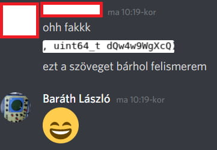



   


# Az utolsó beadandó

## Sztoritájm

Ennek a feladatnak van egy kis története is. A BME-VIK Villamosméröki képzésén az idei utolsó beadandó "Programozás Alapjai 1" tárgyból egy hallgatói visszajelzés volt - azaz írjuk ki `stdout`-ra hogy mi tettszett a kurzusban, és `stderr`-re hogy mi nem.

Ezt a nagyon nehéz feladatot ~ két sorban meg lehet csinálni, de persze az *túl egyszerű lenne* úgyhogy megírtam ezt a programot - és mivel egészen jól sikerült összekuszálnom egy egyszerű kiírást, feladtam feladatnak hogy aki tudja, fejtse vissza és írja át...

## Segítség

Mivel nem sokan jöttek rá, adtam egy tippet: 65537

Ez az egy szám meglehetősen nagy segítség lehet. Elég rákeresni a neten, [külön Wikipédia-oldala is van](https://en.wikipedia.org/wiki/65,537), ahonnan is megtudhatjuk, hogy
>65537 is commonly used as a public exponent in the RSA cryptosystem.

Ami lelövi hogy itt valószínűleg RSA-ról lesz szó...

## Nevek

Első ránézésre is egyértelmű, hogy a változókat és függvényeket *érdekesen* neveztem el. 

Többféle kódot használtam, szóval nézzük csak végig őket, hogy mit is jelentenek - bár a program kontextusában egyik sem bír jelentéssel

### csoeoe, fueuetoeoecsoeoe

Ennek a két névnek érdekes története van, amelyet *Fiala Péter* előadó mesélt el az egyik előadáson.

Valamikor régebben, az egyik diák a beadandó nagyházijának egy "központi fűtés vezérlő" programot írt. A probléma az volt, hogy nem igazán tartotta be az egyik legfontosabb szabályt a változó- és típusnevekről, azaz hogy **csakis angol neveket adjunk** - ehelyett a táviratoknál használt kódolással írta át a `cső`-t `csoeoe`-re és a `fűtőcső`-t `fueuetoeoecsoeoe`-re. Nem is lett volna baj, ha éppen nem felejt ki valahol egy `oe`-t, és kerül egy napjába megtalálni az elütést...

### thatFirstParam, paramNumberOne
Még akár értelme is lenne ezeknek a neveknek, ha nem ugyanannak a függvénynek lennének mindketten "első" paraméterei

### dQw4w9WgXcQ

Ehhez csak ennyit fűznék hozzá:

[Aki nem hiszi, az járjon utána!](https:///youtube.com/watch?v=dQw4w9WgXcQ)

Ez egyben egy hint is volt a következőre:

### lahpnRVxkU8
Ez ugyanis szintén egy YouTube-id, nevezetesen **Randall** `Simulating every single pixel in my game` [videójára](https://www.youtube.com/watch?v=lahpnRVxkU8).

Randall amúgy a világ leg... beszívottabb DevLog-jait csinálja, érdemes végignézni őket.

### base64

- ZWxzb1BhcmFtZXRlcg -> elsoParameter
- bWFzb2Rpa1BhcmFtZXRlcg -> masodikParameter
- dXRvbHNvUGFyYW1ldGVy -> utolsoParameter
- dmFsYW1pUmFuZG9tVmFsdG96bw -> 
valamiRandomValtozo

Legalább a számozás itt jó volt

### OA_AOO_OA_A, O_OAO_OAO_AA_OOO_AAO

Morze kód, `.` -> `dOt` -> `O` és `-` -> `dAsh` -> `A` helyettesítéssel

- OA_AOO_OA_A -> ADAT
- O_OAO_OAO_AA_OOO_AAO -> ERRMSG

Ennek pedig még egy kevés értelme is van, bár nem sokkal több mint a többinek

Dekódoltuk tehát a neveket, de sokkal okosabbak nem lettünk

## RSA

(az RSA titkosítás villanyon elvileg SzA-ból tananyag szokott lenni, de idén kimaradt. A BSz-ről nem tudok, lehet hogy ott szerepelt az infósoknak)

Az RSA titkosítás megértéséhez a legfontosabb ismerni az [Euler-Fermat-tételt](https://en.wikipedia.org/wiki/Euler%27s_theorem) (pontosabban Carmichael tételét, amely ennek egy általánosabb alakja):
$a^{\varphi (n)}\equiv 1 (mod\;n)$ ha n és a relatív prímek - azaz egy $n$-el relatív prím számot a $\varphi(n)$-edik hatványra emelünk, akkor az $n$-el vett osztási maradéka 1 lesz. Ennek következménye, hogy $\varphi(n)$ bármely többszörösére ez ugyanígy igaz lesz, és $a^{k\varphi (n)+1}\equiv a (mod\;n)$. 

Ez azt jelenti, hogy ha találunk egy $E\equiv 1 (mod\;\varphi(n))$ számot, akkor bármely $a$-t amely relatív prím $n$-el erre a hatványra emelve visszakaphatjuk az eredeti számot.

Ha olyan $E$-t találunk amely két szám szorzata, akkor a fenti kongruenciában szereplő hatványozást két lépésben is elvégezhetjük (hiszen hatvány hatványozásánál a kitevők összeszorzódnak) - de a köztes eredményből más hatványozással nem kaphatjuk meg ugyan ezt.

$n$-t általában két **nagyon** nagy prím szorzatát választják (továbbiakban $p$ és $q$). Ha ismerjük a prímeket, akkor $\varphi(n)$ nagyon könnyen számítható, de a prímek ismerete nélkül ez nagyon reménytelen.

A valós RSA-eljárásban $\varphi(n)$ helyett $\lambda(n)$-t használják (Carmichael-féle tóciensfüggvény), amely ebben az esetben könnyen számítható: $\lambda(n)=lcm(p-1, q-1)$

Az RSA-eljárás kulcsgenerálása tehát:
- választunk két nagyon nagy prímet ($p$ és $q$)
- $n=pq$, ez része mindkét titkosítási kulcsnak
- $\lambda(n)=lcm(p-1, q-1)$ (pl. Euklideszi algoritmussal)
- választunk egy $1< e <\lambda(n)$ számot, ami relatív prím $\lambda(n)$-el (általában 65537, mint itt is) - ez lesz a publikus kulcs kitevője
- keresünk egy olyan $d$ számot amelyre $de\equiv 1(mod\;\lambda(n))$ - például Euklideszi algoritmus segítségével megoldva a kongruenciát - ez a $d$ lesz a privát kulcs kitevője

Mindkét kulcs két számból áll tehát:
- privát kulcs (d, n)
- publikus kulcs (e, n)

A kódolás egy adott ($exp$, $md$) kulccsal egyszerű: $m$ -> $r\equiv m^{exp}\;(mod\;md)$

A két kulcs egymás inverze: ha egy adatot mindkét kulccsal kódolunk (bármilyen sorrendben), visszakapjuk az eredetit. A két sorrend felhasználása:
- titkosított üzenet küldése valakinek: a publikus kulccsal kódoljuk - így senki más sem fogja tudni elolvasni, csak akinek szántuk
- üzenet aláírása: lekódoljuk a saját privát kulcsunkkal - így egyértelmű hogy mi küldtük, hiszen csakis a mi publikus kulcsunkkal lehet dekódolni

## Implementáció

Az én programom csak a dekódolást valósítja meg. A `csoeoe` segédfüggvény 64 bites szorzást és maradékképzést valósít meg (128 bitre bővítve, mert különben a részeredmény során hibás értéket kaphatunk), míg a `fueuetoeoecsoeoe(m, kitevo, modulus)` függvény pedig a hatványozást ([ismételt négyzetre emelésekkel](https://en.wikipedia.org/wiki/Exponentiation_by_squaring)).

## Kulcs

Könnyedén leolvasható, hogy a publikus kulcsban a kitevő 65537, és a modulus pedig 23507814067939. Ez a modulus pedig meglehetősen kicsi - könnyedén felbontható az eredeti két prímre, [akár egyszerű online eszközökkel is](https://www.numberempire.com/numberfactorizer.php?number=23507814067939&_p1=2193): `23507814067939 = 2424241 * 9696979`

(a prímeket kézzel választottam)

Ez alapján a leírtaknak megfelelően elég könnyen előállítható egy érvényes titkos kulcs, és lehet vele kódolni egy adathalmazt.

[Vissza](cpuzzles.md)