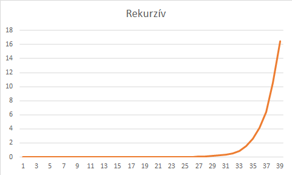
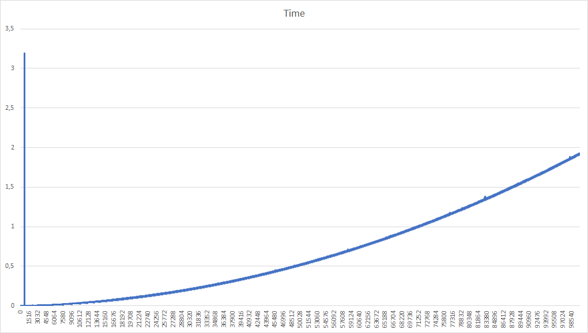

# Programok futásidejének elemzése, és egy anomália

[Vissza](../prog.md)

Egyik osztálytársam találta ki 12. osztályban, hogy szeretne megtanulni programozni. Javasoltam neki a Pythont, mivel szerintem az egy elég kellemes nyelv, főleg hogy a srác elég matekos beállítottságú. 

Én eközben éppen OKTV-re készültem (olvasgatva a Cormen-könyvet illetve próbálkozva feladatmegoldással, több-kevesebb sikerrel). Megkérdezett pár dolgot, és elbeszélgettünk az aszimptotikus futásidőkről és ennek a jelentéséről.

Később (ezt már asszem a nyáron) végül csináltunk pár praktikus tesztet, a fibonaci-algoritmusokkal.

Ugye van a "naiv", rekurzív algoritmus:
```python
def fib(n):
    if n in (1, 2):
        return 1
    return fib(n-1) + fib(n-2)
```

Felrajzolható a függvényhívásokból egy fagráf, és bizonyítható, hogy a függvényhívások száma egészen jól követi a fibonacci-sorozatot, amit pedig a matekosok már bizonyítottak hogy exponenciálisan nő, ami egy program futásidejének esetén nem éppen jó dolog.

Futásidő grafikon egy mérés alapján:


Optimalizálható egy tucat módon ez az algoritmus, az egyik például a DP-s memoization (feljegyzéses módszer):
```python
from functools import lru_cache

@lru_cache(None)
def fib_memo(n):
    if n in (1, 2):
        return 1
    return fib_memo(n-1) + fib_memo(n-2)
```
Talán feltűnő hogy a függvénytörzs pontosan ugyanaz, mint a rekurzív verziónál - viszont az `lru_cache` dekorátor automatikusan megnézi először a cache-ben, illetve belerakja ha kiszámoltuk.

Egy másik verzió:
```python
def fib_lin(n):
    if n in (1, 2):
        return 1
    s = [1] * n
    for i in range(2,n):
        s[i] = s[i-1] + s[i-2]
    return s[n-1]
```

Ezt persze még mindig lehet tovább optimalizálni, mint olvashatóság, mind helyigény szempontjából (tömb helyett elég lenne 2 változó).

A tankönyv szerint ezek a verziók mind lineáris aszimptotikus futásidővel rendelkeznek. A közösen írt programokat egy időmérő kóddal futtattuk egy Banana Pi-n, [kb. egy fél napig gyűjtve az adatokat.](fibo.xlsx)

Na és egy futásidő-grafikon:


Erről két dolog látszik első látásra:
- egy bazi nagy csúcs még 1k alatt
- hogy baromira nem lineáris, hanem négyzetes, még ha a négyzetes tag együtthatója kicsi is

Az elsőnek az oka elég egyszerű: a futás közben Ctrl+Z-vel lepauseoltam a programot, hogy utána `bg`-vel és `disown`-al a háttérbe küldjem és kiléphessek az ssh munkamenetből, és csinálhassak mást a gépemen amíg a program számol. A csúcs a felfüggesztett futás miatt keletkezett, amíg a parancsokat beírtam.

A másodikon egy darabig gondolkoznom kellett, de aztán rájöttem. `fib(n)` exponenciálisan nő. Ez azt jelenti, hogy ahogy egyre nagyobbakat számolunk ki, úgy egyre több helyiérték kell a számok tárolásához. A nyelvek nagy részében ilyenkor integer overflow történik és átmegy negatívba (vagy kicsibe ha unsigned), esetleg összeomlik a program. Pythonan bezzeg nem, simán több helyet foglal az eredménynek, és több bittel számol a továbbiakban. Ez eléggé baromi hasznos tud lenni, mivel pythonban így NINCS overflow. 

**Viszont ez azt is jelenti, hogy minél nagyobb számunk van, annál tovább tart számolni velük!**

Egészen pontosan a számok exponenciálisan nőnek, de az összeadáshoz szükséges műveletek száma egyenesen arányos a szükséges bitek számával, ami pedig a nagyságrenddel. A nagyságrendet pedig logaritmussal kapjuk - az exponenciális logaritmusa pedig lineáris. Az összeadás így nem konstans idejű, hanem lineáris `n`-től ha `fib(n)`-t adjuk össze. A ciklusban lineáris pedig jelen esetben négyzetes futásidőt jelent. Hazudtak hát a tankönyvek, a lineáris algoritmus négyzetes!

... illetve nem feltétlen, hiszen külön egy fejezet foglalkozik azzal hogy mik a módszer határai, mikor használható és mikor nem, és biztos vagyok benne hogy említi hogy "feltételezve hogy az összeadás konstans idejű művelet". Viszont biztos vagyok benne hogy nem hangsúlyozza ki ezeknél a példáknál hogy itt bizony az exponenciális növekedés miatt az összeadás átmegy lineáris műveletbe.

Amúgy ez nem egyedi a Pythonban. Ha éppenséggel más nyelvet használunk, akkor a helyfoglalást fixen úgy kell méretezni hogy beleférjünk - és ugyanott vagyunk, csak egy lépést kézzel végeztünk el. Ez a futásidő a teljes értelmezési tartományon lineáris lenne, viszont ahogy egyre bővítjük az értelmezési tartományt, négyzetesen viselkedne. A Python automatikus méretezése viszont pont hogy lefaragott az időből, mert a kisebb számoknál nem pazarol, és így máris egyértelmű hogy négyzetes a futásidő görbéje.

Versenyeken általában részben emiatt gyakori hogy a hasonló sorozatokat úgy kell számolni, hogy végig modulo valamennyivel (ami befér egy int32-be általában) számolunk. Így a számok egy tartományon fixen belül maradnak, és ez a probléma gyak. megszűnik. Kipróbáltuk ezt is a haverommal, és máris egy nagyon szép lineáris görbét kaptunk...

[Vissza](../prog.md)