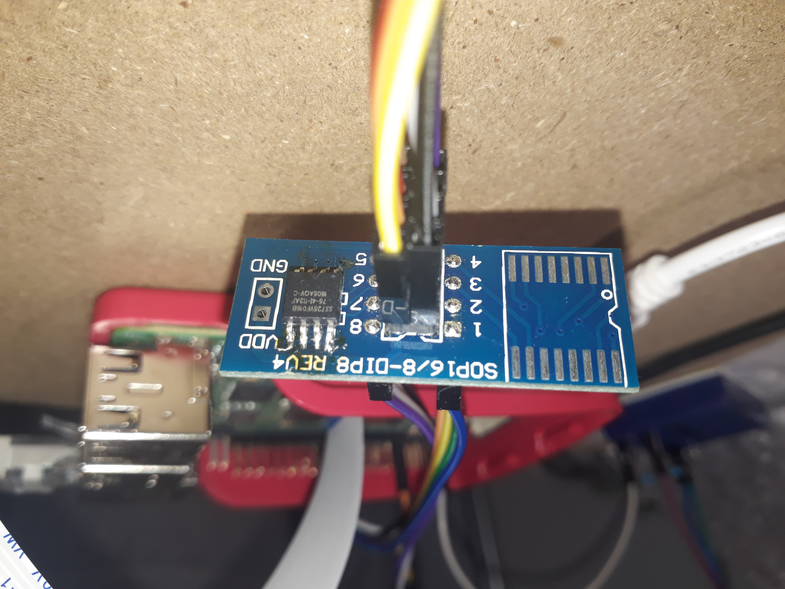

# SPIcy information

- hard

You have successfully captured the communication between a Raspberry Pi and some external chip. You don't know (yet) what the chip does, but it must be something very important. The chip itself is visible on the chipsetup.jpg photo, and the communication captured by your logic analyzer is in everything.sal (you can open it with Saleae Logic 2).

Note: You shouldn't encounter corrupted files, we have had problems unpacking with jefferson, so if you run into problems using it, you should just try some other tool or method!

author: kapi

Attached files:
- [chipsetup.jpg](chipsetup.jpg)
- [everything.sal](everything.sal)

## Writeup

I've first looked at [chipsetup.jpg](chipsetup.jpg):


You can see that the only chip is a `SST25VF016B`.    
Googling that part number leads us to it's [datasheet](http://ww1.microchip.com/downloads/en/DeviceDoc/20005044C.pdf), from witch we can learn that it's a 16Mbit SPI Serial Flash - basically a small external storage device.

The other file was a Saleae Logic savefile, in witch we can see the 2-directional communication between the computer and the IC. It's 2+2 wire serial protocol:
- `MOSI` or Master Out Slave In
- `MISO` or Master In Slave Out
- `SCK` or Serial Clock
- `CS` or Chip Select

But Saleae did some heavy lifting for us and already decoded the serial communication, so we had a big table with 2 important columns: MISO and MOSI, for what each of those are sending.

I've quickly exported the data into CSV so I could parse it with Python. I've implemented parsing with the help of the datasheet for reading commands, but it turned out that I also need the data written, so did that too.
```python
DATA = [0]*2**24
WR = False


def read_data(iter):
    ADR = 0
    ADR = ADR*256 + int(next(iter).split(",")[2][2:], 16)
    ADR = ADR*256 + int(next(iter).split(",")[2][2:], 16)
    ADR = ADR*256 + int(next(iter).split(",")[2][2:], 16)
    print(f"Reading from {hex(ADR)}")
    #DATA = []
    while True:
        _, _, mosi, miso = next(iter).split(",")
        if mosi=="0x00":
            DATA[ADR] = int(miso[2:],16)
            ADR += 1
        else:
            #print(f"Read {len(DATA)} bytes")
            return int(mosi[2:], 16)

def write_enable(iter):
    print("WRITE ENABLED!")
    WR = True
    _, _, mosi, miso = next(iter).split(",")
    return int(mosi[2:], 16)

def aai_program(iter):
    ADR = 0
    ADR = ADR*256 + int(next(iter).split(",")[2][2:], 16)
    ADR = ADR*256 + int(next(iter).split(",")[2][2:], 16)
    ADR = ADR*256 + int(next(iter).split(",")[2][2:], 16)
    print("AAI-programming!")
    print(hex(ADR))
    DATA[ADR] = int(next(iter).split(",")[2][2:], 16)
    DATA[ADR+1] = int(next(iter).split(",")[2][2:], 16)
    ADR += 2
    while True:
        _, _, mosi, miso = next(iter).split(",")
        if mosi=="0x05":
            next(iter)
        elif mosi=="0xAD":
            DATA[ADR] = int(next(iter).split(",")[2][2:], 16)
            DATA[ADR+1] = int(next(iter).split(",")[2][2:], 16)
            ADR += 2
        else:
            return int(mosi[2:], 16)

def wr_dis(iter):
    print("Write disabled!")
    WR = False
    _, _, mosi, miso = next(iter).split(",")
    return int(mosi[2:], 16)

def get_status(iter):
    #print("Write disabled!")
    next(iter)
    _, _, mosi, miso = next(iter).split(",")
    return int(mosi[2:], 16)

def byte_program(iter):
    ADR = 0
    ADR = ADR*256 + int(next(iter).split(",")[2][2:], 16)
    ADR = ADR*256 + int(next(iter).split(",")[2][2:], 16)
    ADR = ADR*256 + int(next(iter).split(",")[2][2:], 16)
    _, _, mosi, miso = next(iter).split(",")
    if DATA[ADR]==0:
        DATA[ADR] = int(mosi[2:], 16)
    _, _, mosi, miso = next(iter).split(",")
    return int(mosi[2:], 16)

BROKER = {
    3: read_data,
    6: write_enable,
    0xad: aai_program,
    4: wr_dis,
    5: get_status,
    2: byte_program,
}

with open("data.csv") as f:
    next(f)
    time, id, mosi, miso = next(f).split(",")
    state = int(mosi[2:], 16)
    try:
        while True:
            state = BROKER[state](f)
            #if state==6:
            #    break
    except StopIteration:
        pass

with open("dump", "wb") as f:
    f.write(bytes(DATA))
```

This resulted in a file with the contents of the chip. I've ran `binwalk` on it:
```
DECIMAL       HEXADECIMAL     DESCRIPTION
--------------------------------------------------------------------------------
604           0x25C           JFFS2 filesystem, little endian
```

I've installed [jefferson](https://github.com/sviehb/jefferson) and asked `binwalk` to extract the filesystem.

Inside it, there were a few interesting files, for example one with the letter `E` repeated 10000 times

(meme by `rnbwdsh`)

Nope, but I've also found an `ARM ELF` binary named `flagreader`. That thing read the contents of the whole flash from a linux pseudo-file, and wrote the flag. I've patched it to read it from the file `dump` and ran it on my Banana-Pi because I did not felt like reversing ARM.