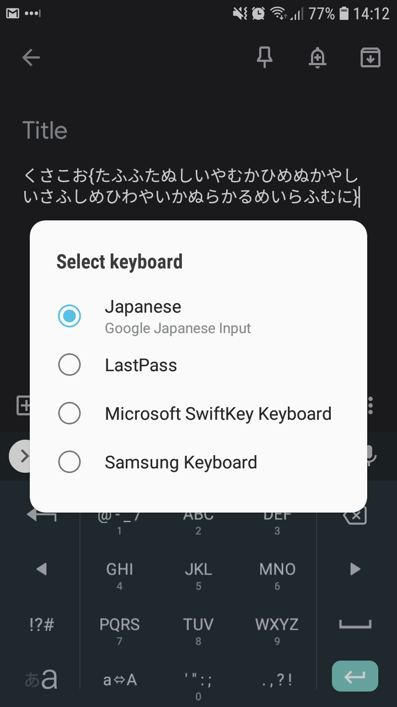

# キーボード・レイアウト

- easy
You have sneaked a peek (and you happen to have photographic memory) at the phone of a colleague.

He is a bit of a weeb, but you know he doesn't actually speak Japanese.

What could this mean on his phone?

_author: kapi_

Attached file:
- [screenshot.jpg](screenshot.jpg)

## Writeup

`キーボード・レイアウト` translates to `Keyboard layout`

Looking at that picture we can see that they are using the `Google Japanese Input` keyboard. Downloading that on a phone reveals that it has two different input methods: Hiragana and English alphabet. They use the same keyboard layout, but swap the symbols.

Trying to enter the first few characters with the first and then writing the letters from the same positions reveals that this method was used to write the flag. It takes some time to decode the flag but it's not hard.