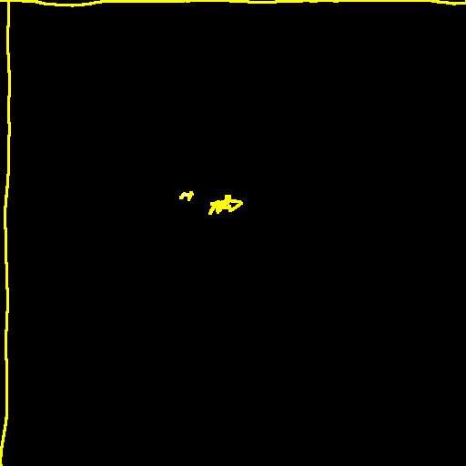

- Road to Valhalla part 1 
- medium

```
- Hey, Nux! Look at this crystal! It's almost as nice as a V8 engine!
- What?
- It looks like... a chrome... thingy.
- What are you talking about. Let me see.
- NO! ITS MINE! I... MUST... DRAW!
```

One of Nux's weirdo friend found a mesmerizing crystal in the desert. After taking it with him, he got posessed with it. He tells weird jokes no one understands, and draws a lot on his shitty computer using an unrecognizeable graphic tablet as old as mankind. However, he won't let you see the drawings, thus, you installed a packet sniffer on his computer.

You managed to get a pcap of one of his drawing. He starts every session by calibrating the graphic tablet. This is achieved by drawing a horizontal and a vertical line, pushing the tip of the pen (draw force calibration), and tilting the pen around.

Your task is to recover the picture he drew.

author: Csf3r3ncz1

Attached files:
- [calibration.pcap](calibration.pcap)
- [challenge.pcap](challenge.pcap)

## Writeup

The capture files are packet capture files, and can be opened with Wireshark.

The communication is USB between a device and host. The first few packets in `calibration.pcap` are device descriptor packets, and we can learn that it's an `XP-PEN` device with descriptor `0x0928`. 

Searching `XP-PEN 0x0928` lead me to [this github issue](https://github.com/hawku/TabletDriver/issues/894). That repo is an open-source graphics tablet driver, and seems to support our model.

In [Tablet.cpp](https://github.com/hawku/TabletDriver/blob/master/TabletDriverService/Tablet.cpp) we can find the parsing of different protocols. From the earlier issue we know what range should the data be in, so we can try all of them until we find one witch is OK.

I've implemeted parsing with `pyshark`:
```python
import pyshark
from binascii import unhexlify
import struct
cap = pyshark.FileCapture("calibration.pcap", display_filter='usb.src == "3.2.3"')
#cap = pyshark.FileCapture("challenge.pcap", display_filter='usb.src == "3.2.3"')
class RD:
    pass

# ...
# I've cut the non-working parsers for other formats from here

# Standard tablet data format
def parse_3(cap):
    DATA = []
    for p in cap:
        data = unhexlify(p.layers[1].usb_capdata.replace(":",""))
        #print(len(data))
        reportData = RD()
        
        reportData.reportId = data[0];
        reportData.buttons = data[1] & ~0x01;
        reportData.x = data[2] | (data[3] << 8);
        reportData.y = data[4] | (data[5] << 8);
        reportData.pressure = data[6] | (data[7] << 8);

        assert reportData.pressure < 8192
        assert reportData.x <= 35560
        assert reportData.y <= 22220
        DATA.append(reportData)
    return DATA

DATA = parse_3(cap)
```

After I've implemented parsing I've hooked it up to `Pillow` to make an image:
```python
DATA = parse_3(cap)

from PIL import Image, ImageDraw

img = Image.new("RGB", (512,512)) #,(255,255,255))

draw = ImageDraw.Draw(img)
for d in DATA:
    x, y, p = d.x, d.y, d.pressure
    x = int(x / 35560 * 512)
    y = int(y / 22220 * 512)
    # I've had a hard time with this coordinate system
    # the docs just confused me...
    de = 1
    el = ((x-de, y-de), (x+de, y+de))
    # or True disables a filter I've used with the challenge.pcap file
    if p > 2048 or True:
        draw.rectangle(el, fill=(255, 255, int(255*p/8192)))

img.save("img.png")
```

The calibration image:


Did the same with the other packet capture, and got the flag.