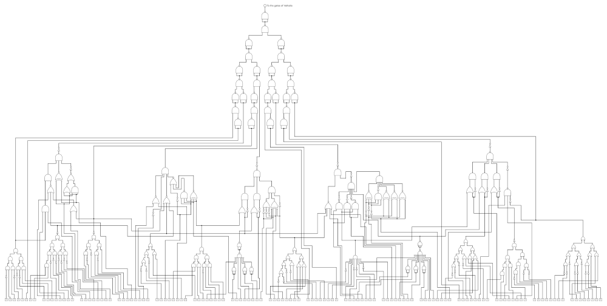
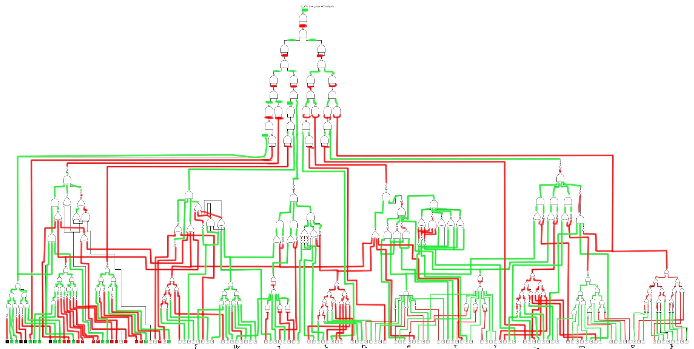

- Road to Valhalla part 4 
- medium

We're here! We're finally here! The gates of Valhalla! What an ancient and robust device! I can't believe I'll finally enter Valhalla and join the glorious V8 gang! But how do I open it?

You've arrived at the gates of Valhalla. Unfortunately, the gates are closed. There is a control board with a bunch of switches next to the door, and a plaque above saying Only the worthy shall enter the gates of Valhalla. There is a circuit engraved on the plaque. We’ve attached it as a picture to this challenge. Can you open the gates of Valhalla?

author: Csf3r3ncz1

Attached file:
- [Gates_of_Valhalla.png](Gates_of_Valhalla.png)

## Writeup

We were given an image file:

(downscaled image so the page is not too slow. See the link above for the original)

As you can see there are a bazillion of logic gates (with those ugly "distinctive symbols", I just like the IEC symbols more), a few input bits and a single output.

The goal is clear: find a combination of input bits such that the output is one. It was not hard, but a bit boring.

I've traced the circuit and marked the lines as red or green for logical HIGH or LOW:

(got a bit bored doing it)

And thus I could just simply read the bits as ASCII and get that flag...