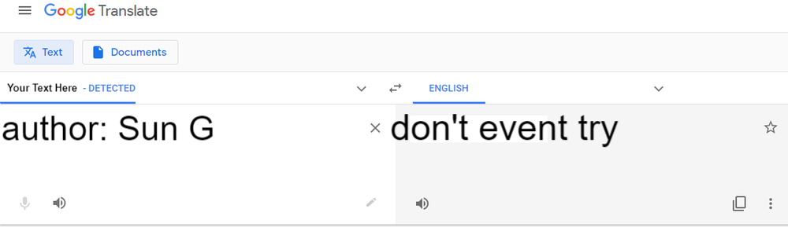

- legend++

[B] Yeah, I'm inside the treatment facility, you copy?

[J] Mm Bill, it does seem that way. Anything on that rusty piece of shit?

[B] Let me see.. it says "Property of WaterWorks LLC, your one stop shop for exquisite cleansing; Tampering strictly prohibited."

[J] Too bad, that is why you are there.

[B] Any clues about what sort of protection we are facing?

[J] The manual says nothing about that but my source suggested it's custom made just for them.

[B] Big oOoOoF.

[J] Apparently it's from the same company that made that other shitty binary protector, BabyPK. Let's see if this is any better.

[B] Right on it chief.

Note: The flag should be submitted in ALL CAPS, like so: `cd21{4LLC4PS}!`

_author: Sun G_

Attached file:
- [activation](activation)

## Notes

**I did NOT solve this challange!**

It was possibly the hardest one in the whole CTF.



I could possibly have solved it, but I've decided not to do it as I've got tired of the whole CTF for some time, and I also got some exams / univerity homeworks, so I've decided to end it for myself early.

What I've recovered (because of course I could not help myself trying a bit):
- ELF64 binary, stripped (no suprise)
- heavyweight binary obfuscation
- SP is "hiden", many push/pop/`lea rsp, [rsp+0x8]` operations
- nearly all operations take place on the stack
- RET-based control flow

It does some `libusb`-stuff, quarrying the devices.

I've also done some GDB-scripting, to help clean up the SP-obfuscation:
```python
import re
MY_LOG = []

virtual_regs = {
    f"ORSP-{8*x}":f"VR{chr(ord('0')+x)}" for x in range(1,9)
}

def step(ORSP):
    gdb.execute("si", to_string=True)
    addr = int(gdb.parse_and_eval("$rip"))
    instr = gdb.execute("x/i $rip", to_string = True).split(":")[-1].strip()
    NRSP = int(gdb.parse_and_eval("$rsp"))
    d = NRSP - ORSP
    instr = instr.replace("QWORD PTR ", "")
    instr = instr.replace("[rsp]", f"[ORSP{d}]")
    instr = instr.replace("[rsp-0x8]", f"[ORSP{d-8}]")
    instr = instr.replace("[rsp+0x8]", f"[ORSP{d+8}]")
    instr = instr.replace("[rsp+0x4]", f"[ORSP{d+4}]")
    instr = instr.replace("pushf","push FLAGS")
    instr = re.sub("push   (.{2,5})",f"mov    [ORSP{d-8}], \\1",instr)
    instr = re.sub("pop    (.{2,5})",f"mov    \\1, [ORSP{d-8}]",instr)
    #instr = instr.replace("push", f"[ORSP{d-8}] = ")
    #instr = instr.replace("pop", f"[ORSP{d}] -> ")
    for k in virtual_regs:
        instr = instr.replace(k,virtual_regs[k])
    if not "rsp" in instr:
        MY_LOG.append(f"0x{addr:016x}: {instr}")

def do_it():
    global ORSP
    gdb.execute("starti", to_string = True)
    gdb.execute("c", to_string=True)
    ORSP = int(gdb.parse_and_eval("$rsp"))
    for _ in range(1000):
        step(ORSP)

def save_data(fname="MY_LOG_4"):
    with open(fname, "w") as f:
        for l in MY_LOG:
            f.write(f"{l}\n")
```

This un-does f-in with SP, makes all push/pop into SP-relative addressing, decodes them as variables, and logs instructions.

Sadly, when trying to trace the program this way it usually segfaults, but that's not the case if using simple breakpoints. I guess I could have written a function to dump every instruction this way, but whatever...